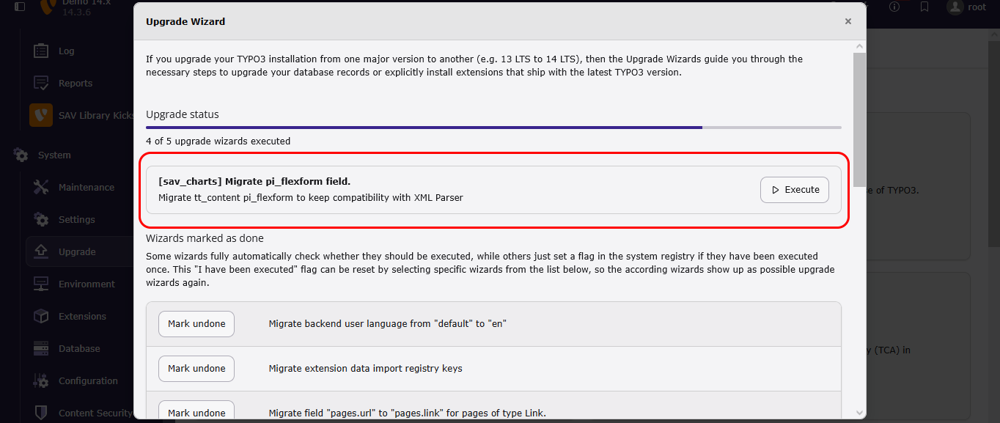

..  include:: ../Includes.txt

..  _administration:

==============
Administration
==============

..  important::

    The flag `Allow queries (Admin)` must be set by an Admin user in the content 
    Flexform to execute queries.
    
..  warning:: 

    This extension generates raw JavaScript codes from the chart configurations 
    in the backend.

    Most often, simple configurations are taken from the Chart.js documentation. 
    However, more complex configurations can be entered. As stated  in the TYPO3 
    Security Guide, "*Even if editors do not insert malicious code intentionally,
    sometimes the lack of knowledge, expertise or security awareness could put 
    your website under risk*".

    Admin users should be careful before granting the rights for backend users 
    to enter charts.
    
The SAV Charts is provided with an upgrade wizard 
that converts the existing 
Flexforms on your website. The upgrade wizard adds 
three sheets to the Flexforms 
(see :ref:`_pluginInterface`). It also duplicates existing
XML parser configurations as closely as possible 
to Fluid parser configurations.

