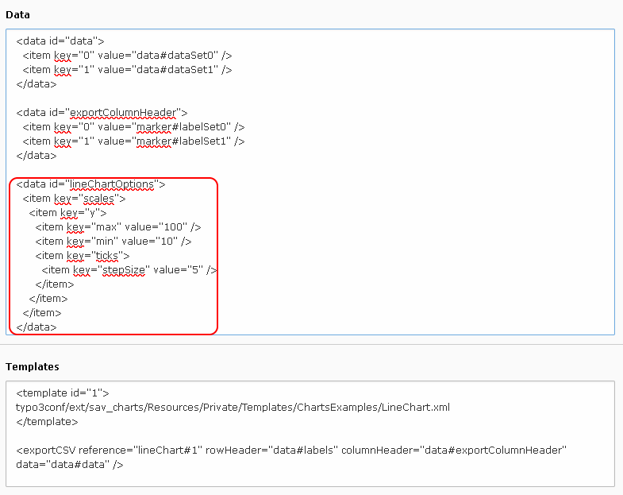
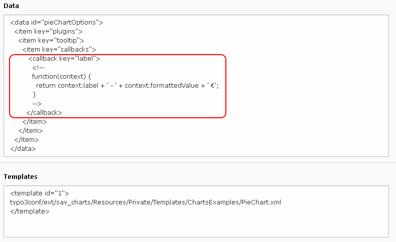
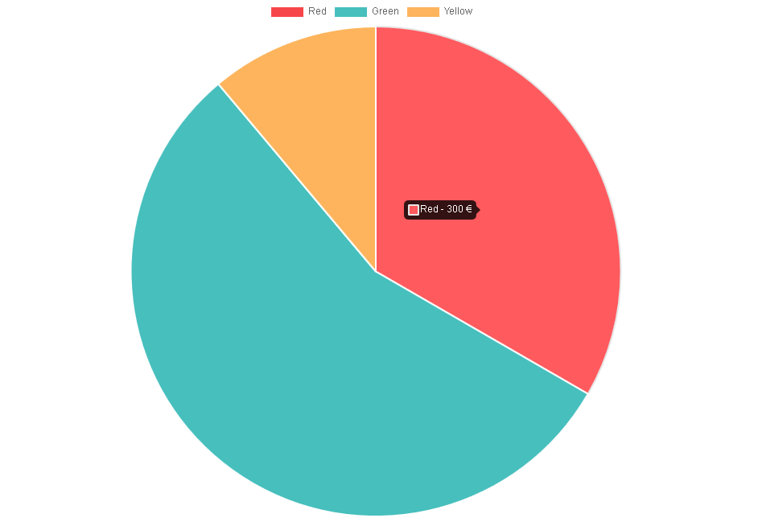
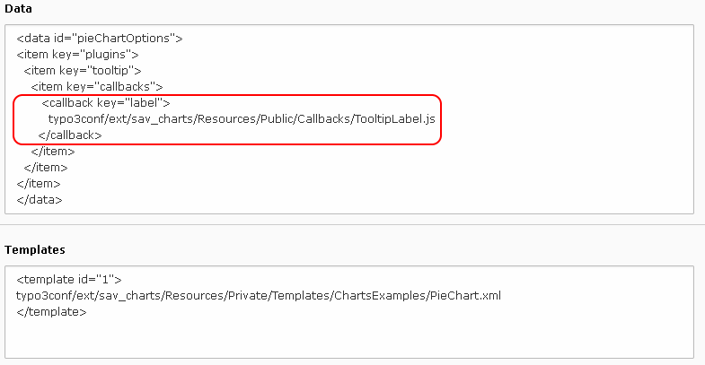
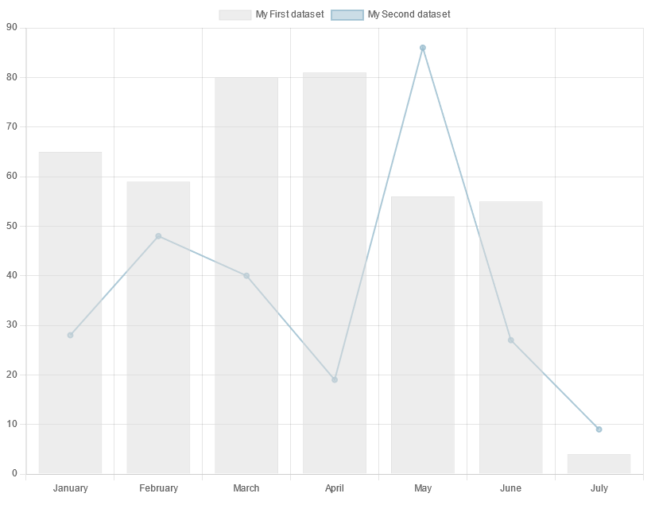

.. include:: ../Includes.txt

.. _faq:
.. role:: red

==========================
Frequently Asked Questions
==========================

.. warning::

	SAV Charts is now using  Chart.js 3.x. Several breaking changes were made in 
	Chart.js 3.0 (see `3.x Migration Guide <https://www.chartjs.org/docs/latest/getting-started/v3-migration.html>`_).
	Main changes concern ``Axis`` and ``Tooltip``. All templates in ``Resources/Private/Templates/ChartsExamples`` 
	were modified to take these changes into consideration.
	
	If you are upgrading Sav Charts, you may have to modify your templates.  
	
How to Generate a Boolean Value?
================================

Set the attribute ``value`` to ``true`` or ``false``.

.. code::

   <data id="barChartOptions">
      <item key="animation" value="false" />
      <item key="responsive" value="false" />
      <item key="plugins">
          <item key="title">
             <item key="display" value="true" />
             <item key="text" value="marker#title" />
          </item>
          <item key="tooltip">
              <item key="backgroundColor">rgba(0,0,0,0.7)</item>
          </item>
      </item>                        
   </data>	 
   
How to Set the y-Axis Properties?
=================================

You can change the default y-axis (or x-axis) properties using the options for the chart. 
For example, assume that the y-axis for the lineChart example has to be changed so that
the minimum is 10, the maximum is 100 and the step is 5.

Add the following configuration in the data section or in your template.

.. code::

   <data id="lineChartOptions">
      <item key="scales"> 
         <item key="y">
            <item key="max" value="100" />
            <item key="min" value="10" />
            <item key="ticks">   
               <item key="stepSize" value="5" />
            </item>
         </item>
      </item>
   </data> 

Save, clear the cache and go to the frontend.

.. figure:: ../Images/FAQ/lineChartWithY-axisOptionsInFrontend.png

.. tip::

   You can easily adapt the previous configuration to other cases by translating 
   the javascript configuration examples given in the documentation. 
   
   The translation is simple:
   
   - Replace options by a ``<data id="..."> ... </data>`` where the ``id`` is the identifier for the chart options (it is defined in the template).
   - Replace opening braces by ``<item>`` tags with attributes as keys.
   - Replace open brackets, if any, by ``<item>`` tags with keys equal to 0.
   - Replace simple attributes inside braces by ``<item />`` tags with key and value attributes.
   - Replace closing braces or brackets by ``</item>`` tags.
   
   For example, the following code changes also the label style of the x-axis. 
   A callback is used to modify the tick labels.
  
   .. code::
    
      <data id="lineChartOptions">
         <item key="scales"> 
            <item key="y">
               <item key="max" value="100" /> 
               <item key="min" value="10" />
               <item key="ticks">      
                  <item key="stepSize" value="5" />
               </item>
            </item>
            <item key="x">
               <item key="ticks">
                  <item key="font">
                     <item key="size" value="15" />
                     <item key="tyle" value="italic" />
                  </item>
                  <item key="color" value="rgb(200, 0, 0)" />
                  <callback key="callback">
                     <!--
                     function(value, index, values) {
                        return '- ' + this.getLabelForValue(value) + ' -';
                     }
                     -->
                  </callback>
               </item>
            </item>
         </item>
      </data>
   
   .. figure:: ../Images/FAQ/lineChartWithYAndX-axesOptionsInFrontend.png   
           
.. note::

   In Chart.js 3.0 , the former ``xAxes`` and ``yAxes`` arrays in ``scales`` were removed.
                
How to Modify the Tooltip Format?
=================================

The tooltip format can be modified using callbacks that are provided with chart.js.
For example let us assume that data provided with the Pie Chart example 
are in €. Let us also assume that we want to change the tiptool content
in order to have ``label - value €`` instead of the defaut format ``label:value``.

Chart.js library allows to modify several behaviors by means of callbacks. 
Please consult the `charts.js documentation <https://www.chartjs.org/docs/>`_ for details.

The tooltip label can been changed by means of the label callback in ``tooltip`` options.

Inline Javascript Function
--------------------------

Add the following configuration in the data section or in your template.

.. code::

   <data id="pieChartOptions">
      <item key="plugins">
         <item key="tooltip">
            <item key="callbacks">
               <callback key="label">
                  <!--
                  function(context) {
                     return context.label + ' - ' + context.formattedValue + ' €';
                  }
                  -->
               </callback>
            </item>
         </item>
      </item>   
   </data>

.. warning::
    
   The javascript function must be in a XML comment.  

Save, clear the cache and go to the frontend.

    

The configuration is simply the translation of the following javascript configuration.   

.. code::
        
   options: {
      plugins: { 
         tooltip: {
            callbacks: {
                label: function(context) {
                   return context.label + ' - ' + context.formattedValue + ' €';
                }
            }
         }
      }
   }

.. note::

	In Chart.js 3.0 ``tooltips`` was renamed ``tooltip`` and 
	is now in the ``plugins`` item of the ``options``. A tooltip item context is avaible in callbacks.
	For more information see the `tooltip section <https://www.chartjs.org/docs/latest/configuration/tooltip.html>`_
	in Chart.js documentation. 
           

Javascript Function in a File
-----------------------------

When the javascript function associated with the callback is more complex, 
you can also put it in a file and call that file in the callback 
as shown in the following configuration.

How to call a JavaScript Function on Events?
============================================

The following configuration shows how to associate the JavaScript function 
``newLegendClickHandler`` with the ``onClick`` event of the ``legend``. 

.. code::

   <data id="barChartOptions">
      <item key="legend">
         <item key="onClick" type="function" value="newLegendClickHandler" />
      </item>                        
   </data>	
   
How to Create a Combination Chart?
==================================

An example which combines a bar chart and a line chart is provided in the directory 
``Resources/Private/Templates/ChartsExamples``. Create a new graph then, in the template 
section, enter the following code, save and go to the frontend.

.. code::

   <template id="1">
      typo3conf/ext/sav_charts/Resources/Private/Templates/ChartsExamples/ComboChart.xml
   </template>     

   
The file ``ComboChart.xml`` is very similar to the file ``BarChart.xml``. Only slight changes were made. 
The ``type`` attribute of the second dataset is set to ``line`` and the ``fill`` attribute to ``false``.

.. code::

   <data id="set1">
      <item key="type">line</item>
      <item key="fill" value="false"/>
			...
   </data>
		
The value for the ``type`` attribute of each chart is given in 
the `charts.js documentation <https://www.chartjs.org/docs/>`_.		
  