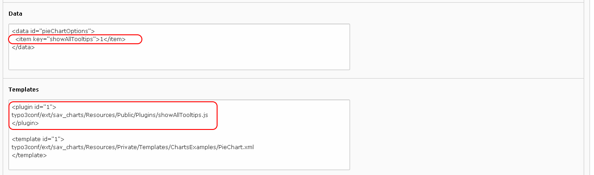
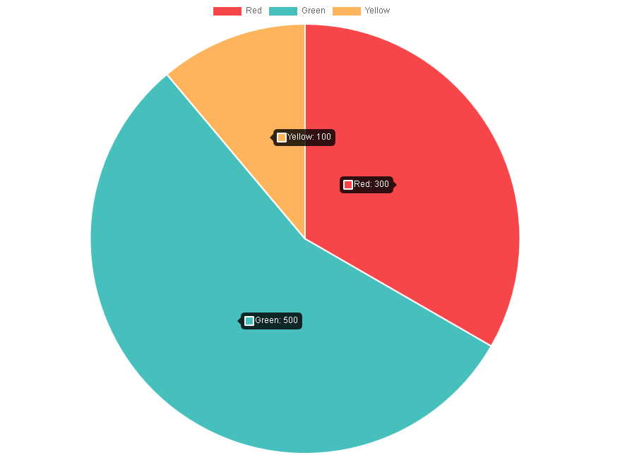

.. include:: ../Includes.txt

.. _faq:

==========================
Frequently Asked Questions
==========================

How to Set the y-Axis Properties?
=================================

You can change the default y-axis (or x-axis) properties using the options for the chart. 
For example, assume that the y-axis for the lineChart example has to be changed so that
the minimum is 10, the maximum is 100 and the step is 5.

Add the following configuration in the data section or in your template.

.. figure:: ../Images/FAQ/lineChartWithY-axisOptions.png

Save, clear the cache and go in the frontend.

.. figure:: ../Images/FAQ/lineChartWithY-axisOptionsInFrontend.png

.. tip::

   You can easily adapt the previous configuration to other cases by translating 
   the javascript configuration examples given in the documentation. For 
   example, the following code can be found in the documentation 
   section related to the configuration options for a linear scale.

   .. code::
    
      options: {
         scales: {
            yAxes: [{
               ticks: {
                  max: 5,
                  min: 0,
                  stepSize: 0.5
               }
            }]
         }
      }
    
   The translation is simple :
    
   - Replace options by a **<data id="..."> ... </data>** where the id is the 
     identifier for the chart options (it is defined in the template).
   - Replace opening braces by **<item>** tags with attributes as keys.
   - Replace open brackets by **<item>** tags with keys equal to 0.
   - Replace simple attributes inside braces by **<item />** tags with key and value attributes.
   - Replace closing braces or brackets by **</item>** tags.

   Thus, the above code is translated as follows:
    
   .. code::
    
      <data id="lineChartOptions">
         <item key="scales"> 
            <item key="yAxes"> 
               <item key="0">
                  <item key="ticks">   
                     <item key="max" value="5" />
                     <item key="min" value="0" />
                     <item key="stepSize" value="0.5" />
                  <item>
               </item>
            </item>
         </item>
      </data> 
        
                
How to Modify the Tooltip Format?
=================================

The tooltip format can be modify using callbacks that are provided with chart.js.
For example let us assume that data provided with the Pie Chart example 
are in €. Let us also assume that we want to change the tiptool content
in order to have **label - value €** instead of the defaut format **label:value**.

Chart.js library allows to modify several behaviors by means of callbacks. 
Please consult the `charts.js documentation <http://www.chartjs.org/docs/>`_ for details.

The tooltip label can been changed by means of the label callback in tooltips options.

Inline Javascript Function
--------------------------

Add the following configuration in the data section or in your template.

.. figure:: ../Images/FAQ/tooltipLabelCallback.png

Save, clear the cache and go in the frontend.

.. figure:: ../Images/FAQ/tooltipLabelCallbackInFrontend.png
    

Once again, the javascript configuration given below can be easily 
translated to be used in SAV Charts.   

.. code::
        
   options: { 
      tooltips: {
         callbacks: {
            label: function(tooltipItem, data) {
               return data.labels[tooltipItem.index] + ' - ' + data.datasets[tooltipItem.datasetIndex].data[tooltipItem.index] + ' �';
            }
         }
      }
   }
        
The translation is the same as in the previous FAQ for all items except the 
callback for which a tag <callback> must be used with the callback name as the key.
     
.. warning::
    
   The javascript function must be in a XML comment.   
    
With these rules, the above code is translated as follows : 

.. code::

   <data id="pieChartOptions">
      <item key="tooltips">
         <item key="callbacks">
            <callback key="label">
               <!--
                  function(tooltipItem, data) {
                     return data.labels[tooltipItem.index] + ' - ' + data.datasets[tooltipItem.datasetIndex].data[tooltipItem.index] + ' �';
                  }
               -->
            </callback>
         </item>
      </item>
   </data>

Javascript Function in a File
-----------------------------

When the javascript function associated with the callback is more complex, 
you can also put it in a file and call that file in the callback 
as shown in the floowing configuration.

.. figure:: ../Images/FAQ/tooltipLabelCallbackByFileName.png

How to Display all Tooltips?
============================

Charts.js has an advanced feature, called plugin, to provide specfic 
behaviors at given steps of the rendering (start of initialization, start of draw...). 
Please consult the `charts.js documentation <http://www.chartjs.org/docs/>`_ for details.

A plugin example is provided with this extension to make it possible to display all tooltips.

Add the following configuration in the sections or in your template.

Save, clear the cache and go in the frontend.

