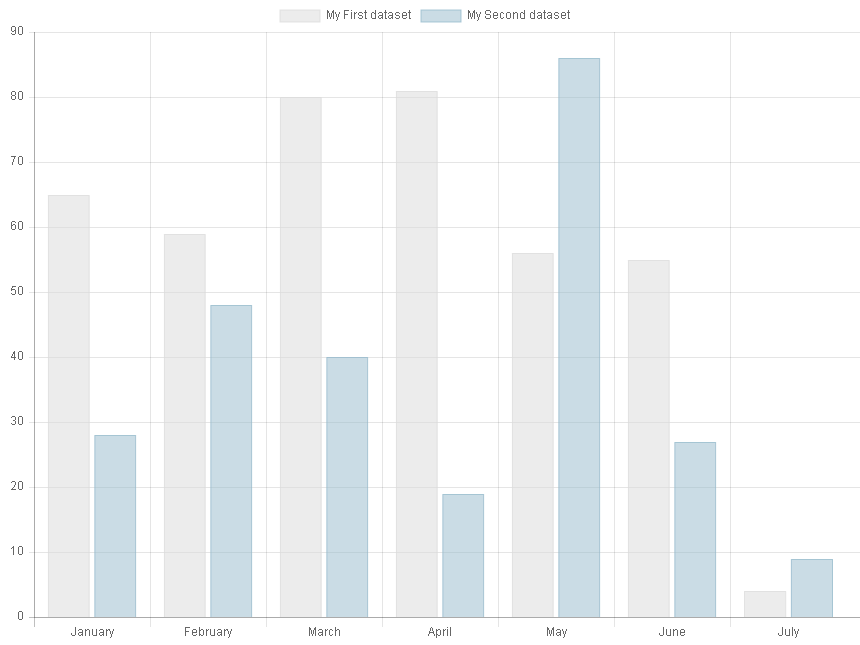
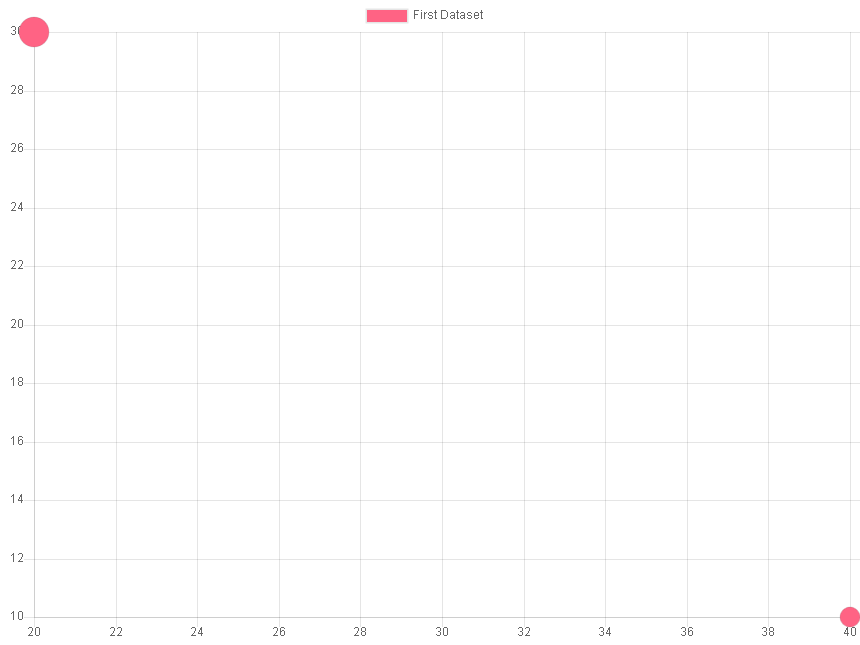
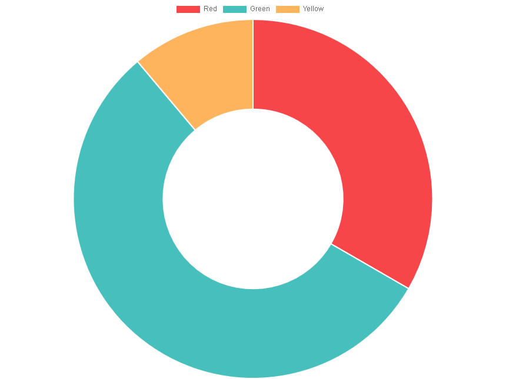
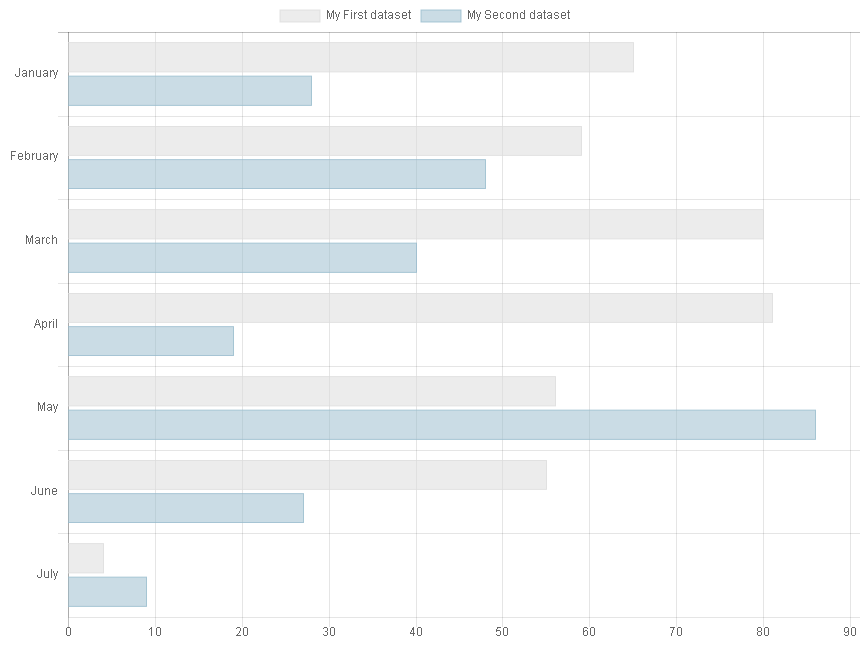
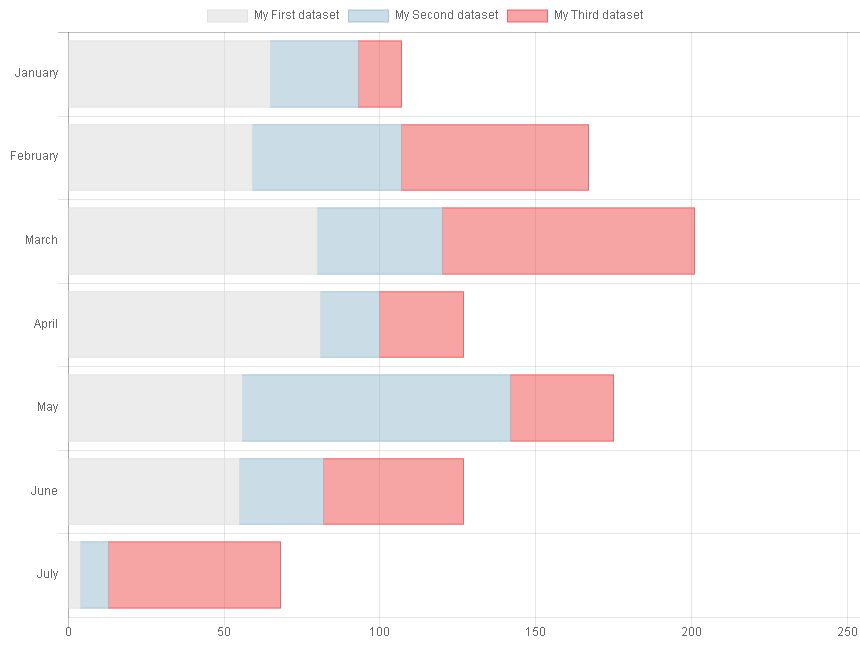
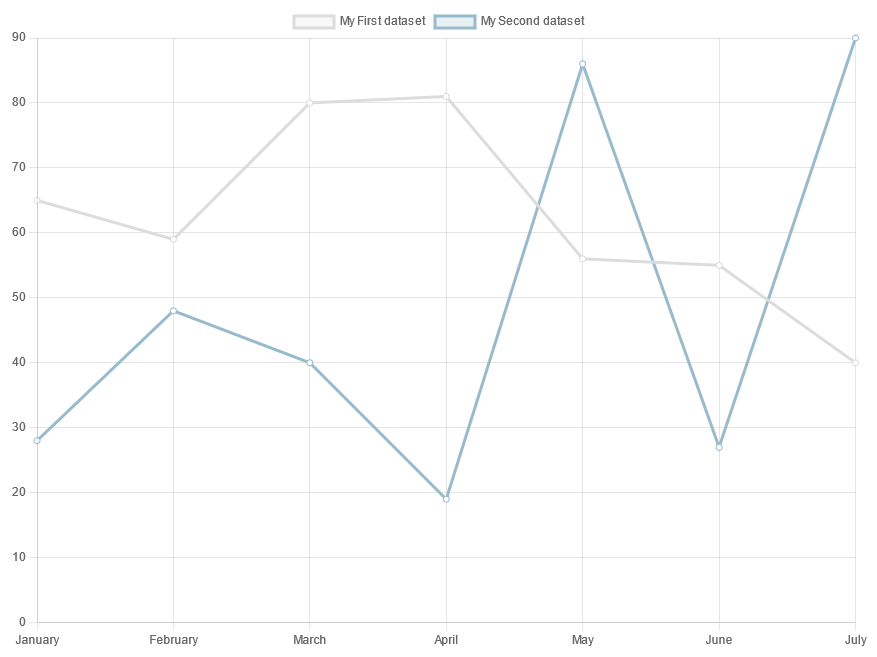
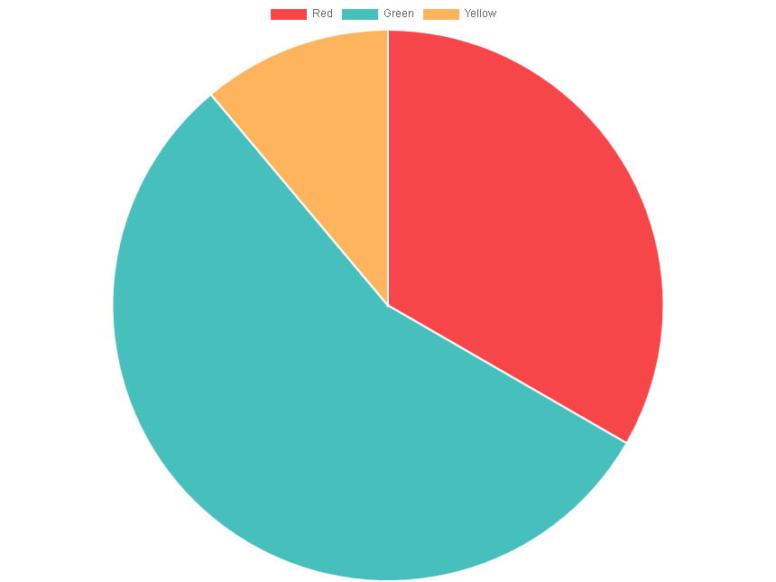
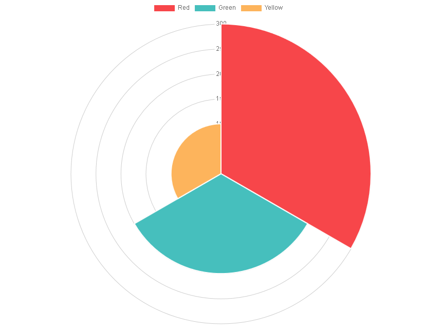
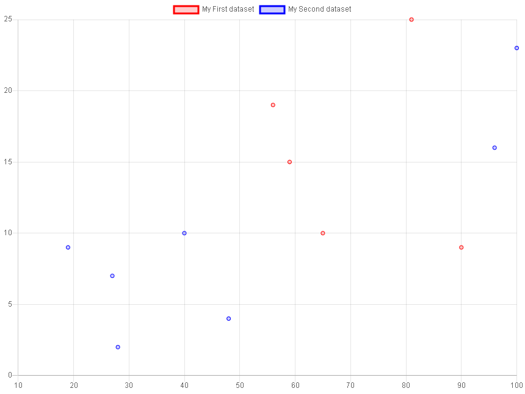
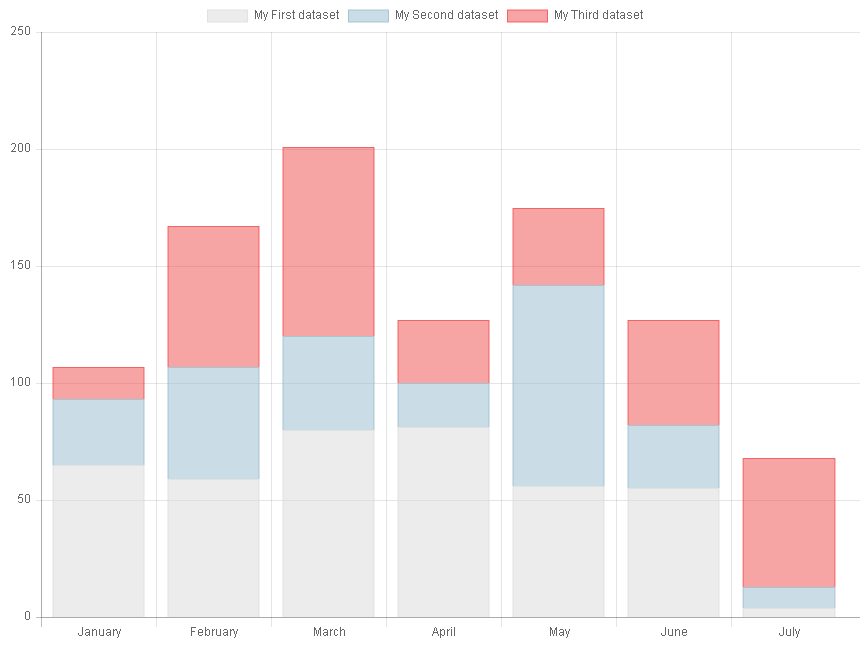

.. include:: ../Includes.txt

.. _introduction:

============
Introduction
============

What Does it Do?
================

This extension makes it possible to develop templates in XML to display charts using the 
`Charts.js library <https://www.chartjs.org/>`_. 

Markers can be introduced in templates. Data can also be changed
through XML either manually or using query managers.

The following charts type are available :

- Bar charts
- Bubble charts
- Doughnut charts
- Line charts
- Pie charts
- Polar area charts
- Radar charts
- Stacked bar charts
- Horizontal bar charts
- Scatter Line Charts
- Charts can also be combined, e.g. a bar chart with a line chart

.. tip::

   SAV Charts is provided with several basic templates and more advanced 
   templates which simplify the implementation of charts with several sets of data.

   The following screenshots are obtained with the provided basic templates.
     
Screenshots
===========

Bar Chart
---------

Bubble Chart
------------

Doughnut Chart
--------------

Horizontal Bar Chart
--------------------

Horizontal Stacked Bar Chart
----------------------------

Line Chart
----------

Pie Chart
---------

Polar Area Chart
----------------

Radar Chart
-----------

.. figure:: ../Images/ScreenShots/radarChart.png

Scatter Chart
-------------

Stacked Bar Chart
-----------------

Combination Chart
-----------------

.. figure:: ../Images/ScreenShots/comboChart.png