..  include:: ../../../Includes.txt

..  _screenShootsApexCharts:

==========
ApexCharts
==========

Examples for the `ApexCharts` library are available in
`Resources/Private/Templates/ApexChartsExamples`.

..  important::

    The Community Licence is free for individuals,
    non-profits, educators, and small businesses 
    with less than $2 million USD in annual 
    revenue. Please read `License Options for ApexCharts
    <https://apexcharts.com/license/>`_.

The following screenshots were obtained
with the provided basic templates. ApexCharts offers 
many other features (see `JavaScript Chart Demos
<https://apexcharts.com/javascript-chart-demos/>`_).

        
Bar Charts
==========

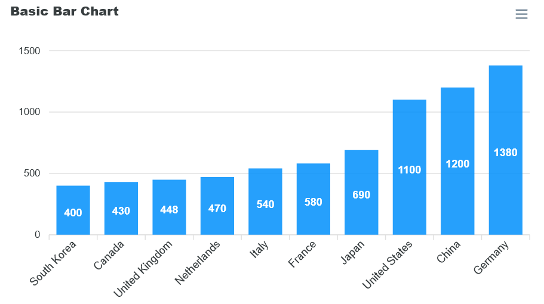
    
Horizontal bar charts, stacked bar charts
are special cases of bar charts.

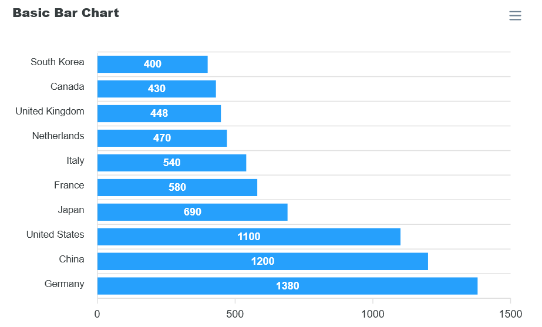

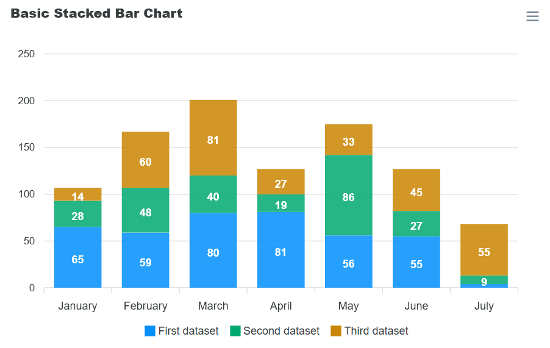
            
Candlestick Charts
==================

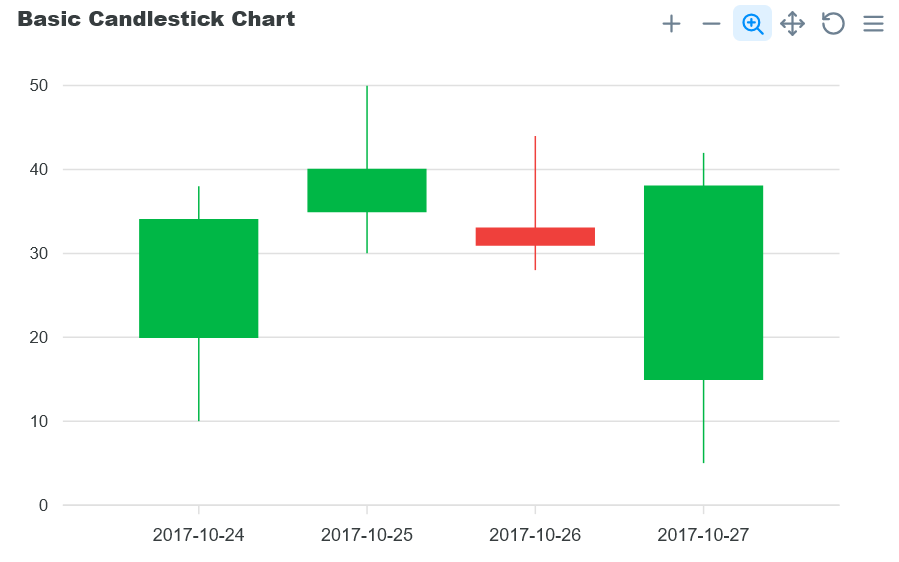

Doughnut Charts
===============

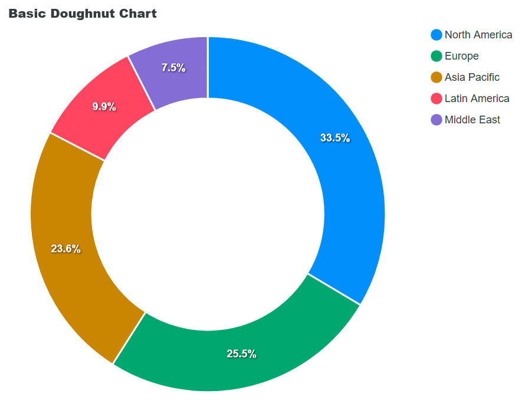

Funnel Charts
=============

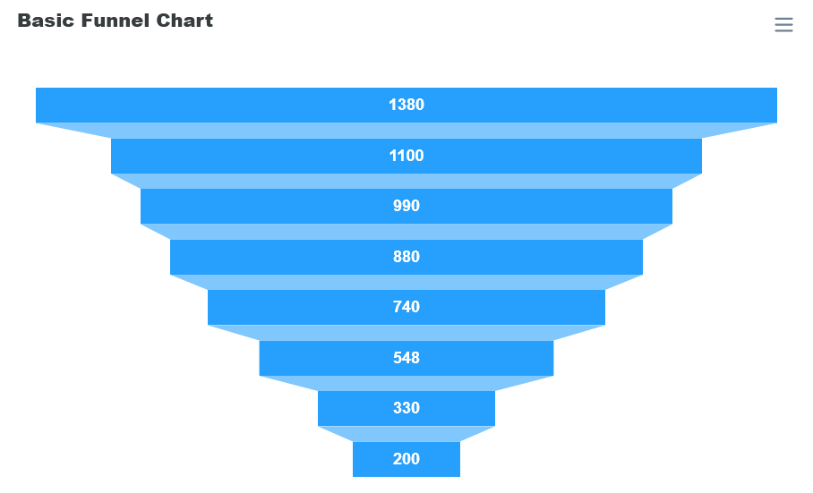

Gauge Charts
============

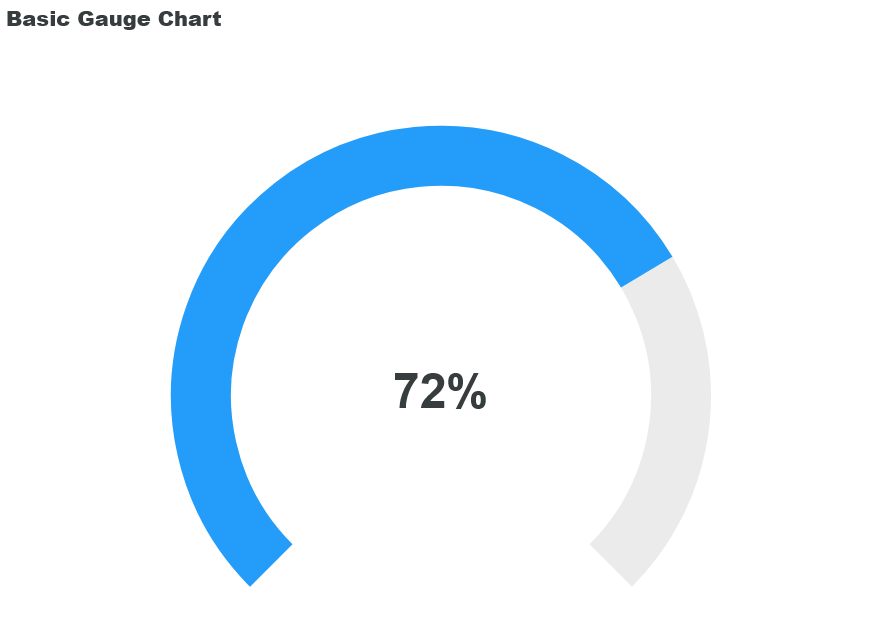
              
Line Charts
===========
        
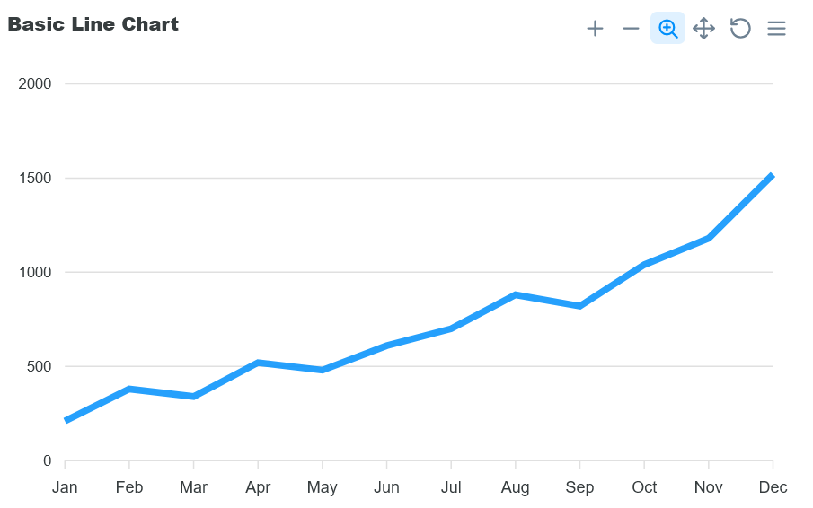
            
Pie Charts   
==========

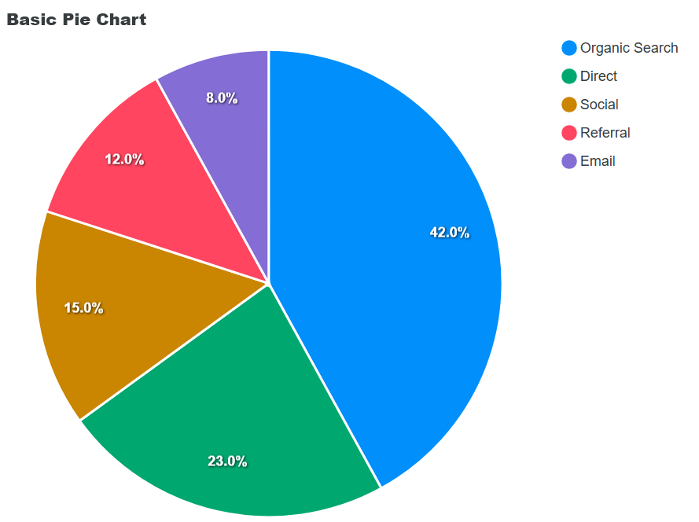

Polar Area Charts   
=================
               
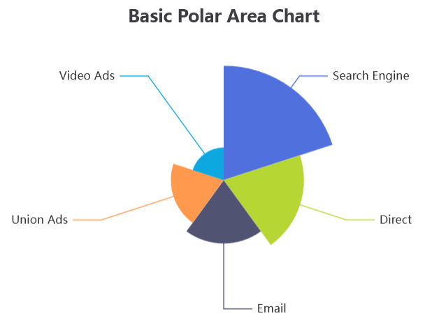
               
Radar Charts
============

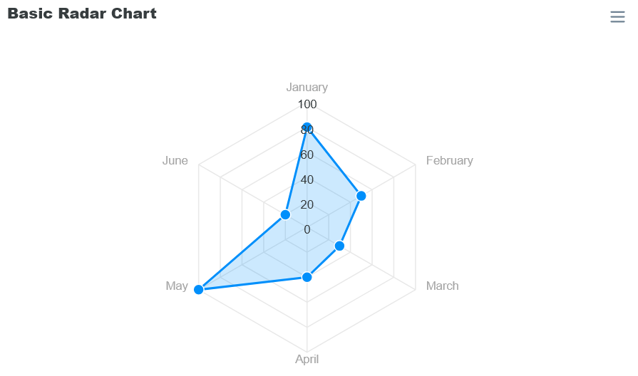
        
Scatter Charts
==============
  
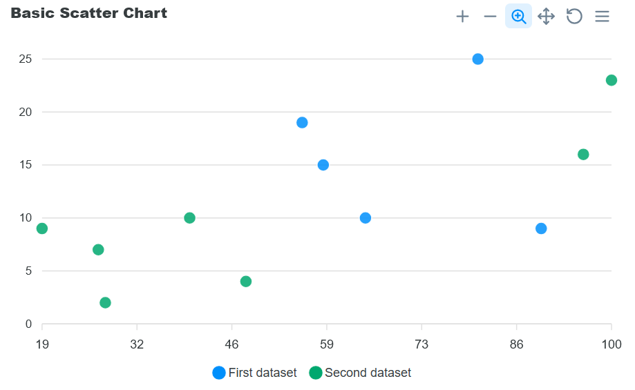
