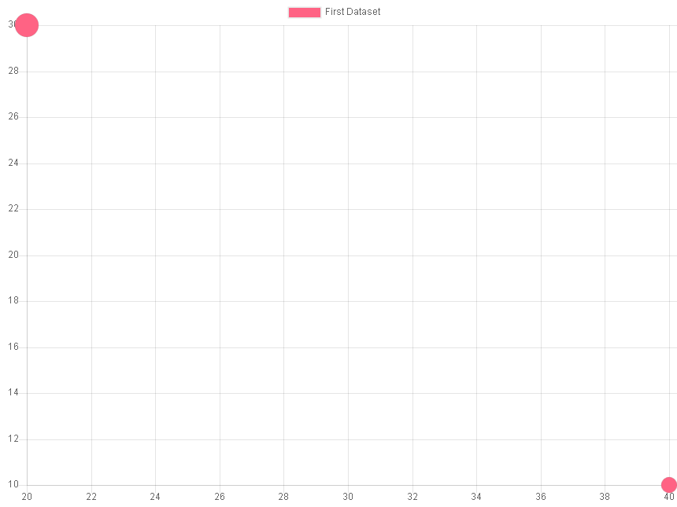
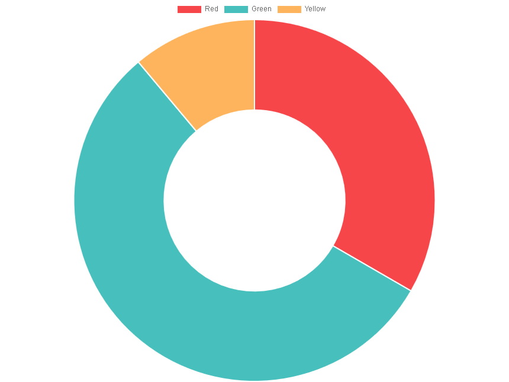
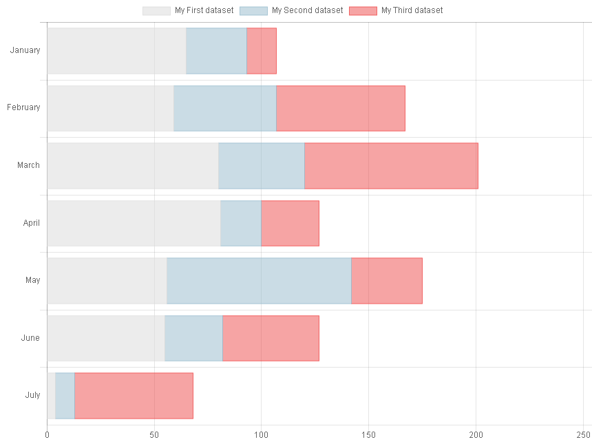
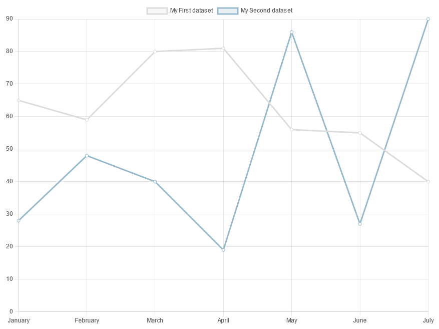
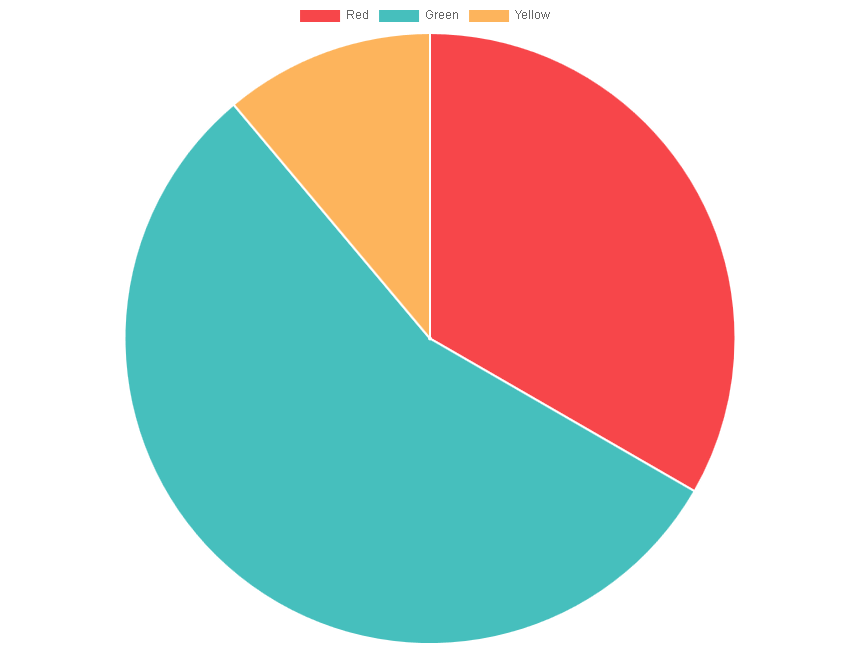
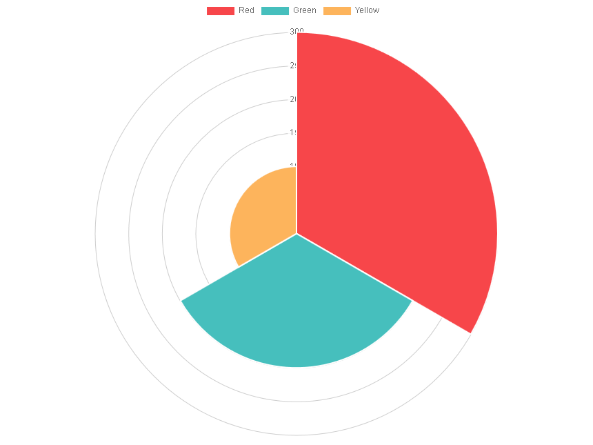
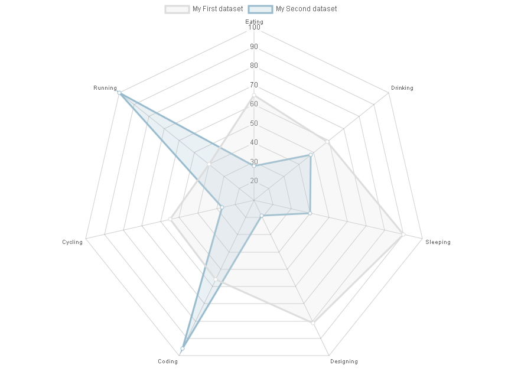
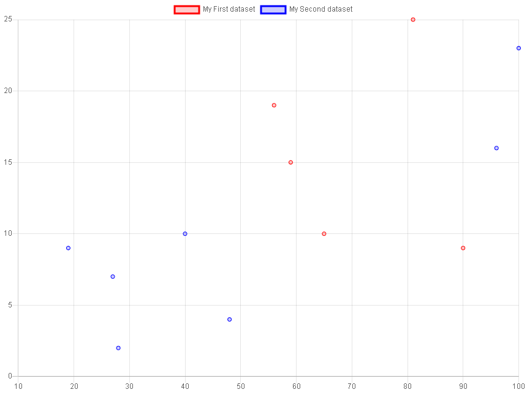
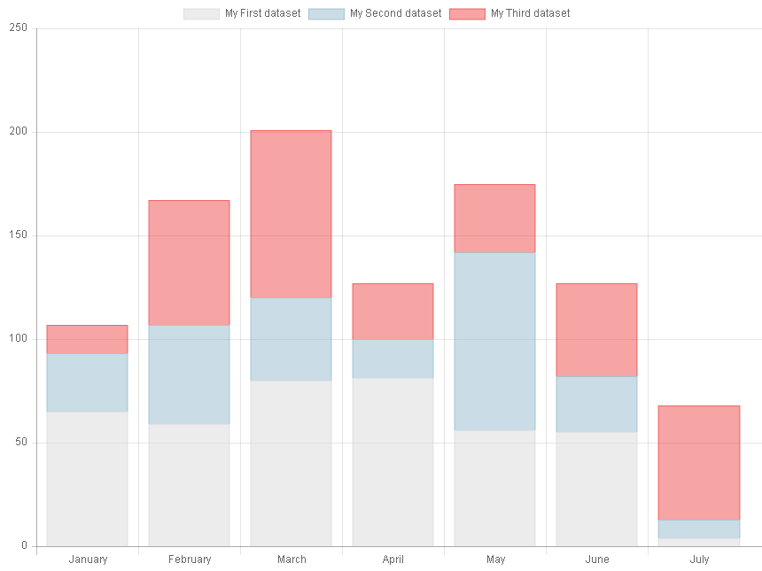
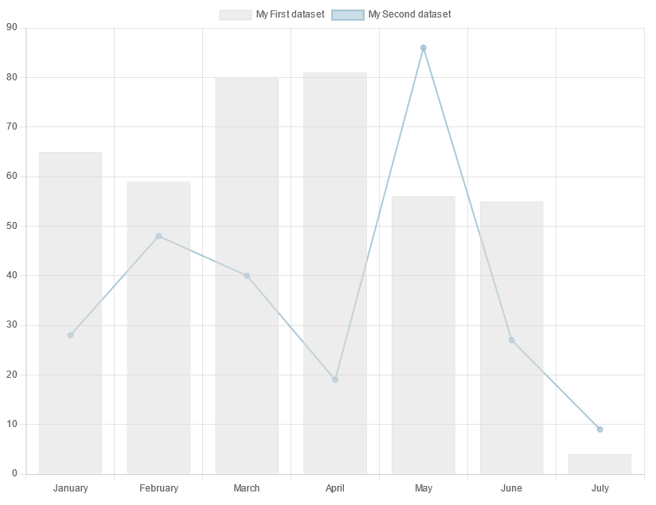

..  include:: ../../../Includes.txt

..  _screenShootsCharts:

=========
Charts.js
=========

Examples for the `Charts.js` library using the Fluid parser are available in
`Resources/Private/Templates/ChartsExamples/FluidParser`.

Examples for the `Charts.js` library using the XML parser are available in
`Resources/Private/Templates/ChartsExamples`.

The following screenshots were obtained
with the provided basic templates. Charts.js offers 
many other features (see `Charts.js Samples
<https://www.chartjs.org/docs/latest/samples/information.html>`_).

Bar Charts 
==========
    
..  figure:: ../../../Images/ScreenShots/Charts/barChart.png
    :width: 50%

Bubble Charts
=============

Doughnut Charts
===============

Horizontal Bar Charts
=====================

Horizontal Stacked Bar Charts
=============================

            
Line Charts
===========

   
Pie Charts
==========
    

                
Polar Area Charts
=================
    

                
Radar Charts
============
    

    
Scatter Charts
==============
    

                
Stacked Bar Charts
==================
    

        
Combo Charts
============

Charts can also be combined 
(Combo charts), e.g. a bar chart 
with a line chart.

