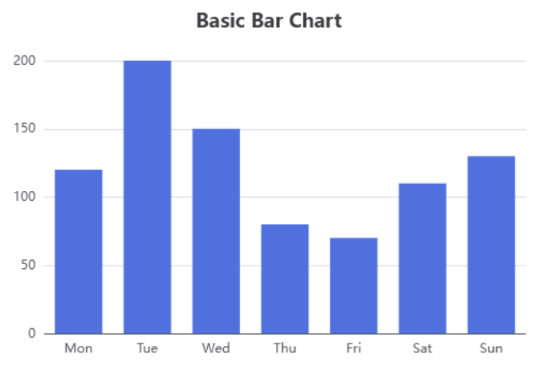
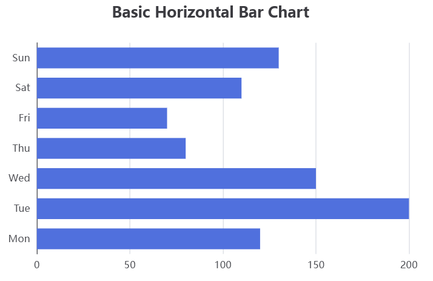
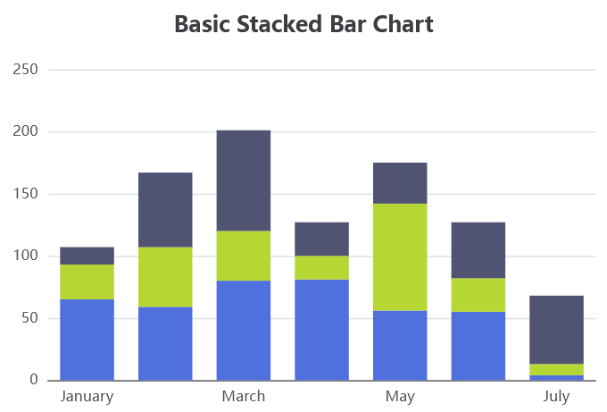
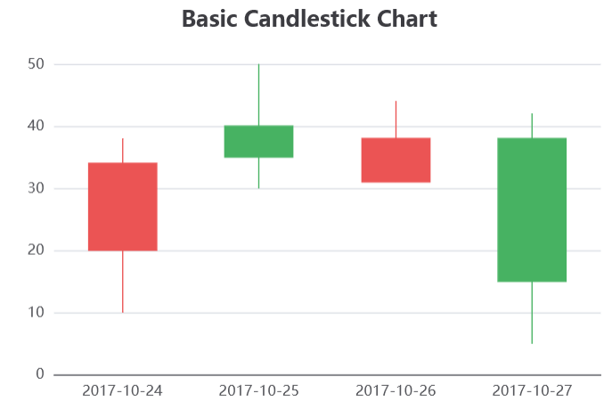
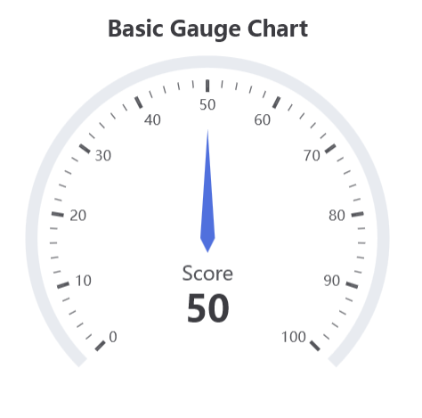
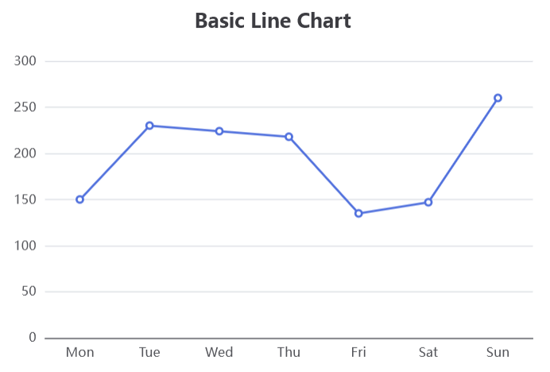
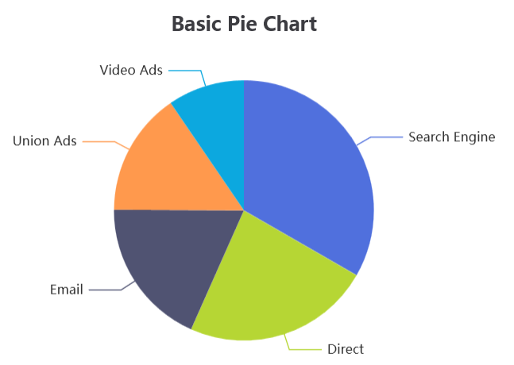
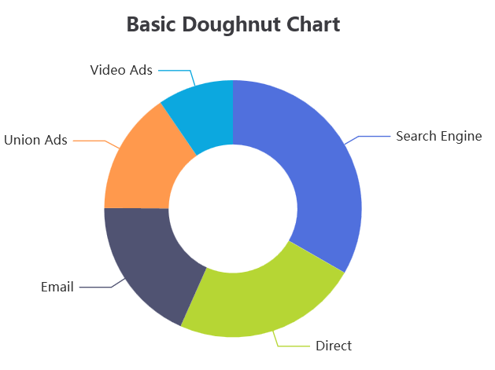
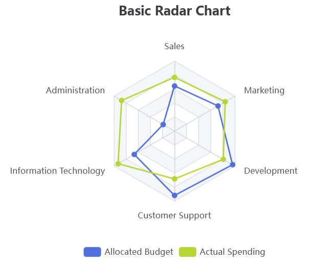
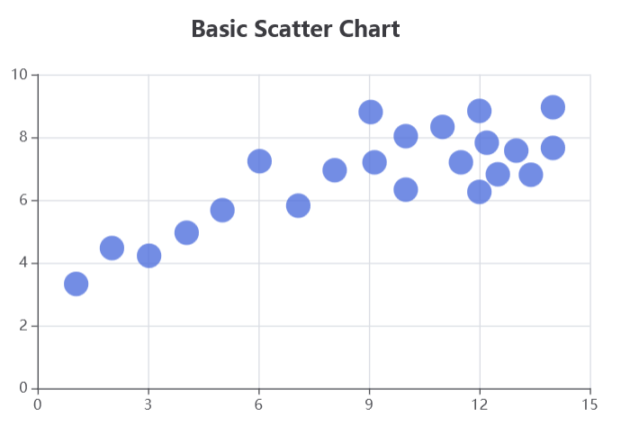

..  include:: ../../../Includes.txt

..  _screenShootsECharts:

=======
ECharts
=======

Examples for the `Apache ECharts` library are available in
`Resources/Private/Templates/EChartsExamples`.

The following screenshots were obtained
with the provided basic templates. Apache ECharts offers 
many other features (see `Apache ECharts Examples
<https://echarts.apache.org/examples/en/index.html>`_).
       
Bar Charts
==========

Horizontal charts, stacked charts
are special cases of bar charts.

            
Candlestick Charts
==================

Funnel Charts
=============

..  figure:: ../../../Images/ScreenShots/ECharts/funnelChart.png
    :width: 50%

Gauge Charts
============

              
Line Charts
===========
        

            
Pie Charts   
==========

Doughnut charts, polar area charts  
are special cases of pie charts.

..  figure:: ../../../Images/ScreenShots/ECharts/polarAreaChart.png
    :width: 50% 
               
Radar Charts
============

        
Scatter Charts
==============
  

