..  include:: ../../Includes.txt

..  _screenShoots:

===========
Screenshots
===========

SAV Charts is provided with several basic templates and more advanced 
templates which simplify the implementation of charts 
with several sets of data.

XML Templates are in the directory `Resources/Private/Templates/ChartsExamples`.

XML templates were also converted to Fluid templates and are available in
`Resources/Private/Templates/ChartsExamples/FluidParser`.

The following chart types are available.
Screenshots were obtained
using the provided basic templates.

Using Charts.js
===============

-   Bar charts 
    
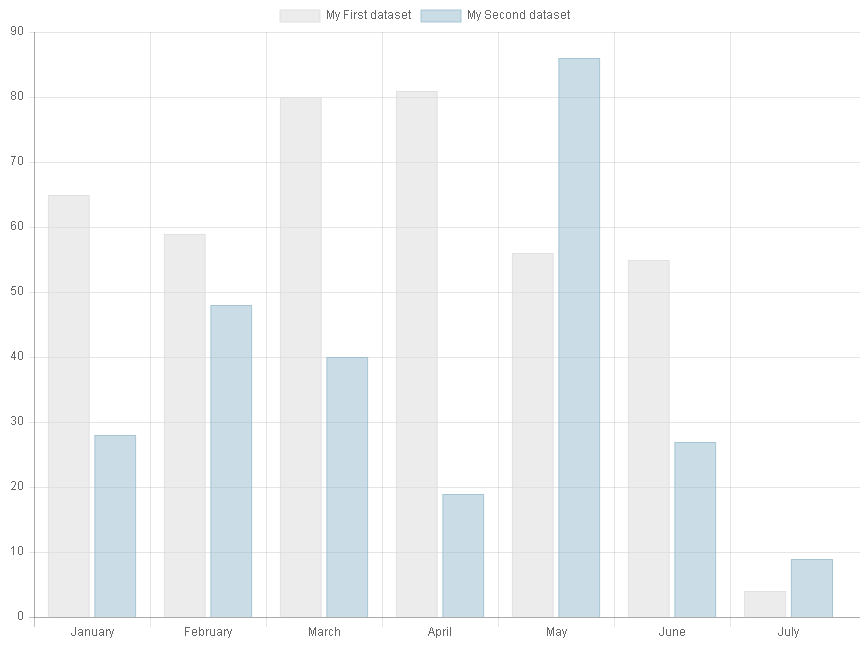

-   Bubble charts

..  figure:: ../../Images/ScreenShots/Charts/bubbleChart.png
    :width: 50%        

-   Doughnut charts

..  figure:: ../../Images/ScreenShots/Charts/doughnutChart.png
    :width: 50%         

-   Horizontal bar charts

..  figure:: ../../Images/ScreenShots/Charts/horizontalStackedBarChart.png
    :width: 50%         

-   Horizontal stacked bar charts

..  figure:: ../../Images/ScreenShots/Charts/horizontalStackedBarChart.png
    :width: 50%   
            
-   Line charts

..  figure:: ../../Images/ScreenShots/Charts/lineChart.png
    :width: 50% 
   
-   Pie charts
    
..  figure:: ../../Images/ScreenShots/Charts/pieChart.png
    :width: 50% 
                
-   Polar area charts
    
..  figure:: ../../Images/ScreenShots/Charts/polarAreaChart.png
    :width: 50% 
                
-   Radar charts
    
..  figure:: ../../Images/ScreenShots/Charts/radarChart.png
    :width: 50%         
    
-   Scatter Charts
    
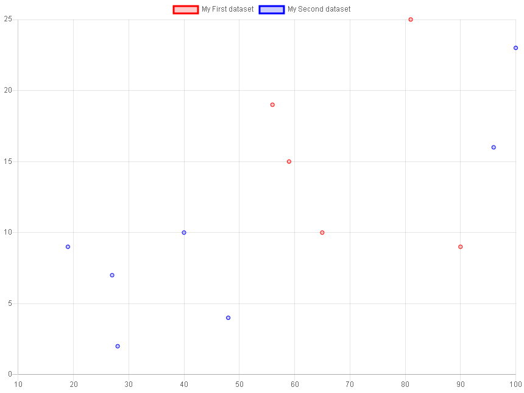
                
-   Stacked bar charts
    
..  figure:: ../../Images/ScreenShots/Charts/stackedBarChart.png
    :width: 50%         
        
Charts can also be combined 
(Combo charts), e.g. a bar chart 
with a line chart.

..  figure:: ../../Images/ScreenShots/Charts/comboChart.png
    :width: 50% 

Using Apache Echarts
====================
        
-   Bar charts

..  figure:: ../../Images/ScreenShots/ECharts/barChart.png
    :width: 50%
            
-   Candlestick charts

..  figure:: ../../Images/ScreenShots/ECharts/candlestickChart.png
    :width: 50%

-   Funnel charts

..  figure:: ../../Images/ScreenShots/ECharts/funnelChart.png
    :width: 50%

-   Gauge charts

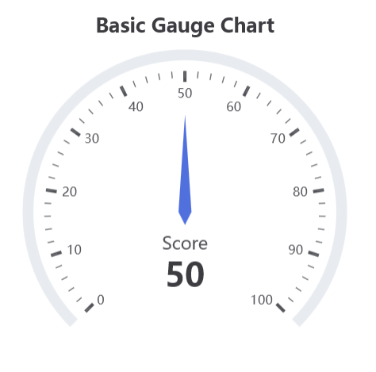
              
-   Line charts
        
..  figure:: ../../Images/ScreenShots/ECharts/candlestickChart.png
    :width: 50%
            
-   Pie charts   

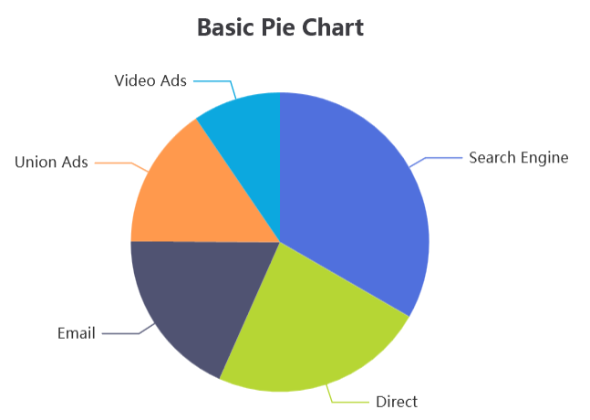
               
-   Radar charts

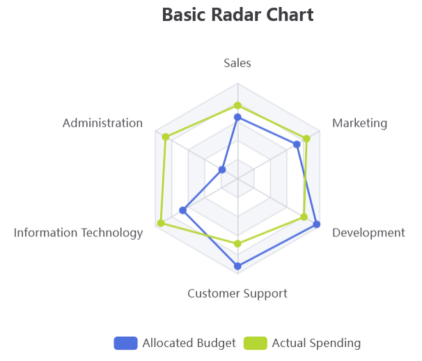
        
-   Scatter charts
  
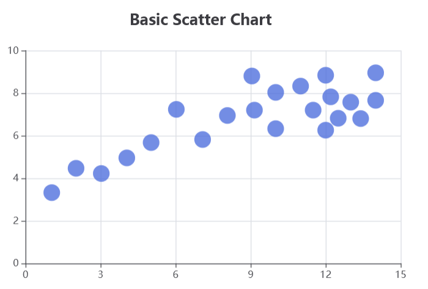

ECharts offers many other features.
Horizontal charts, stacked charts
are special cases of bar charts.

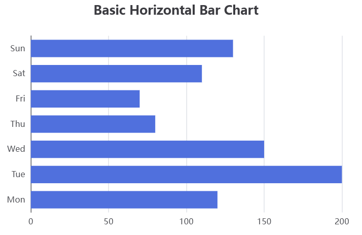

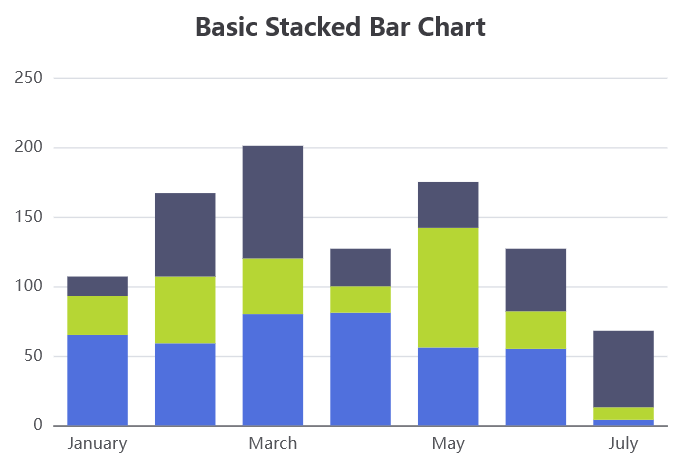
            
Doughnut charts, polar area charts  
are special cases of pie charts.

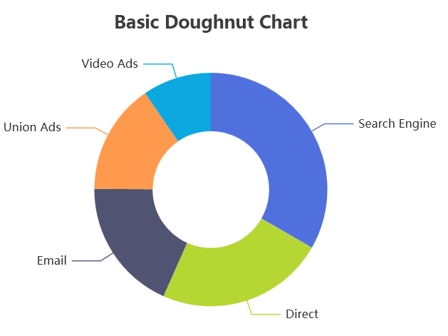

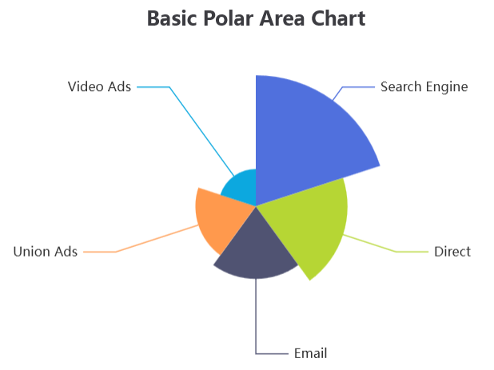

Using Queries or Spreasheets
============================

Charts can be built with data coming from queries.

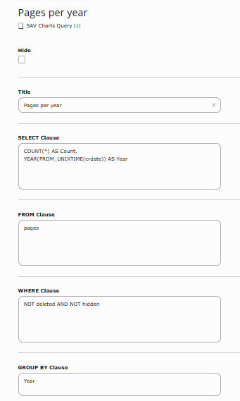

..  figure:: ../../Images/Tutorial/barChartWithQueryInFrontEnd.png
    :width: 50% 
                
Charts can also be built with data coming from spreadsheets.

..  figure:: ../../Images/Tutorial/ExcelWorksheetExample2.png
    :width: 50% 
    
..  figure:: ../../Images/Tutorial/ExcelWorksheetExample2PieChartPercentage.png
    :width: 50%