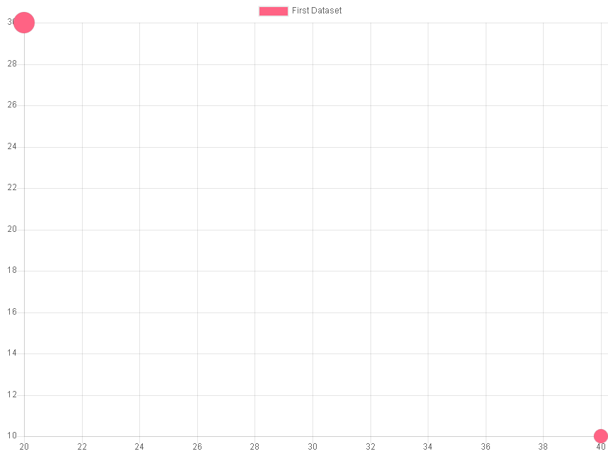
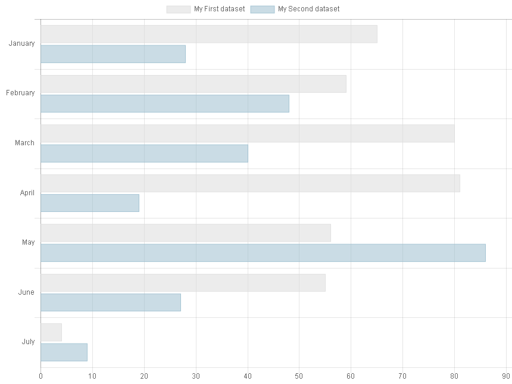
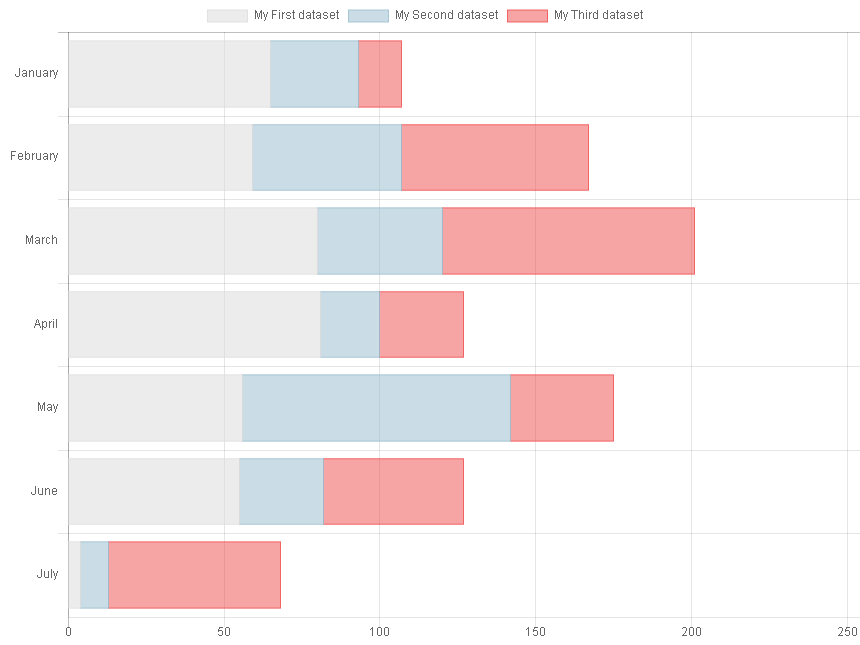
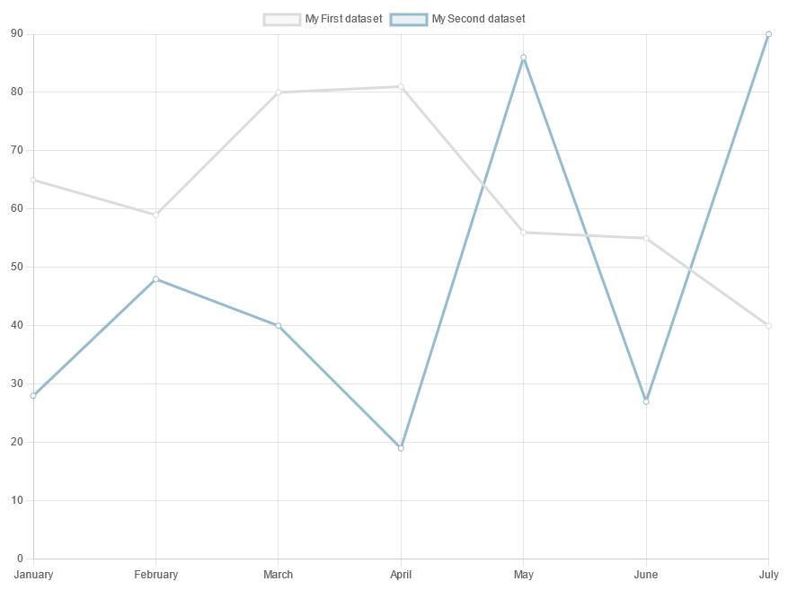
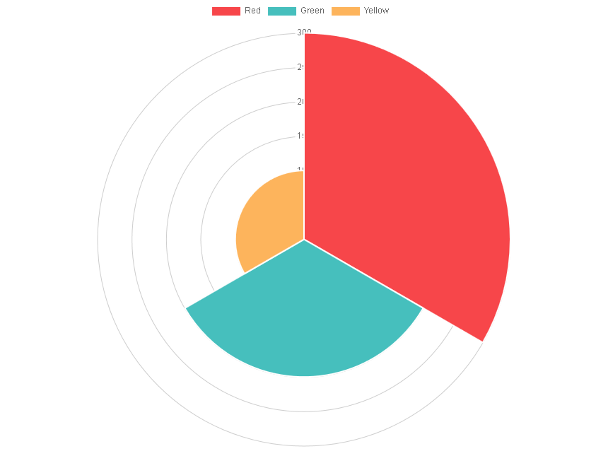
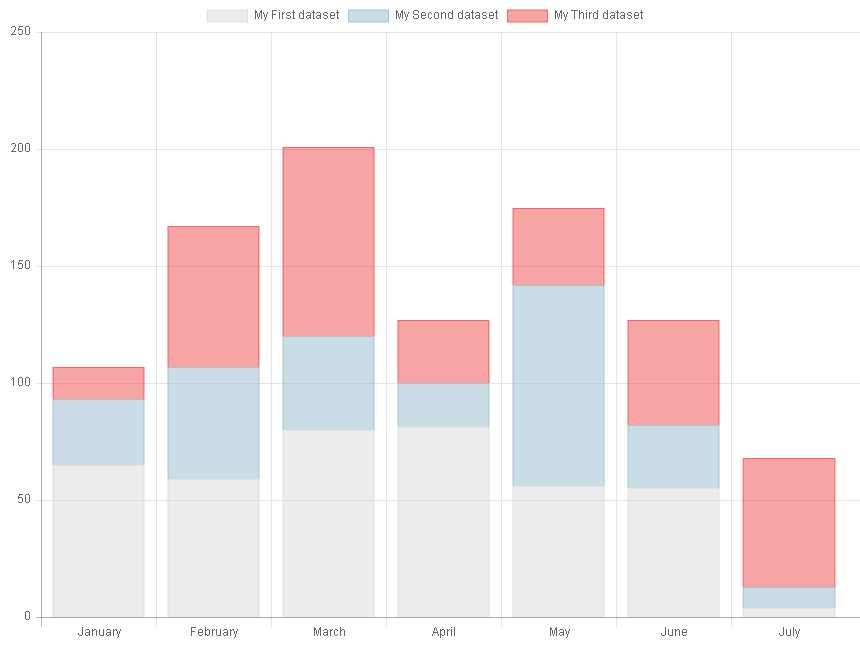
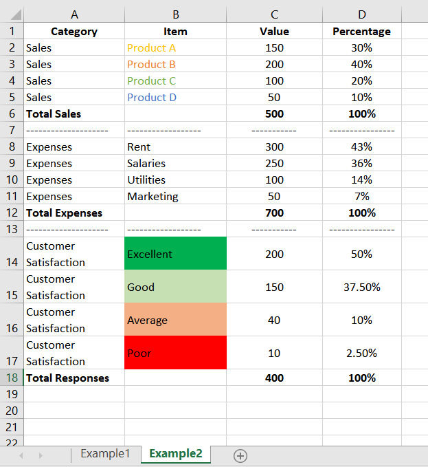
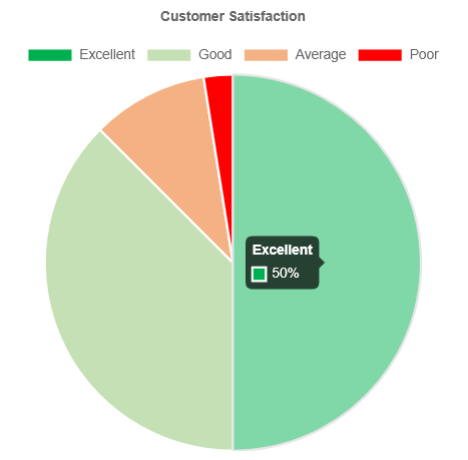

..  include:: ../../Includes.txt

..  _screenShoots:

===========
Screenshots
===========

SAV Charts is provided with several basic templates and more advanced 
templates which simplify the implementation of charts 
with several sets of data.

XML Templates are in the directory `Resources/Private/Templates/ChartsExamples`.

XML templates were also converted to Fluid templates and are available in
`Resources/Private/Templates/ChartsExamples/FluidParser`.

The following charts type are available screenshots are obtained
with the provided basic templates:

-   Bar charts
-   Bubble charts
-   Doughnut charts
-   Line charts
-   Pie charts
-   Polar area charts
-   Radar charts
-   Stacked bar charts
-   Horizontal bar charts
-   Scatter Line Charts
-   Charts can also be combined (Combo charts), e.g. a
    bar chart with a line chart

Bar Chart
=========

..  figure:: ../../Images/ScreenShots/barChart.png

Bubble Chart
============

Doughnut Chart
==============

..  figure:: ../../Images/ScreenShots/doughnutChart.png

Horizontal Bar Chart
====================

Horizontal Stacked Bar Chart
============================

Line Chart
==========

Pie Chart
=========

..  figure:: ../../Images/ScreenShots/pieChart.png

Polar Area Chart
================

Radar Chart
===========

..  figure:: ../../Images/ScreenShots/radarChart.png

Scatter Chart
=============

..  figure:: ../../Images/ScreenShots/scatterChart.png

Stacked Bar Chart
=================

Combination Chart
=================

..  figure:: ../../Images/ScreenShots/comboChart.png

Chart built from a Spreadsheet
==============================

