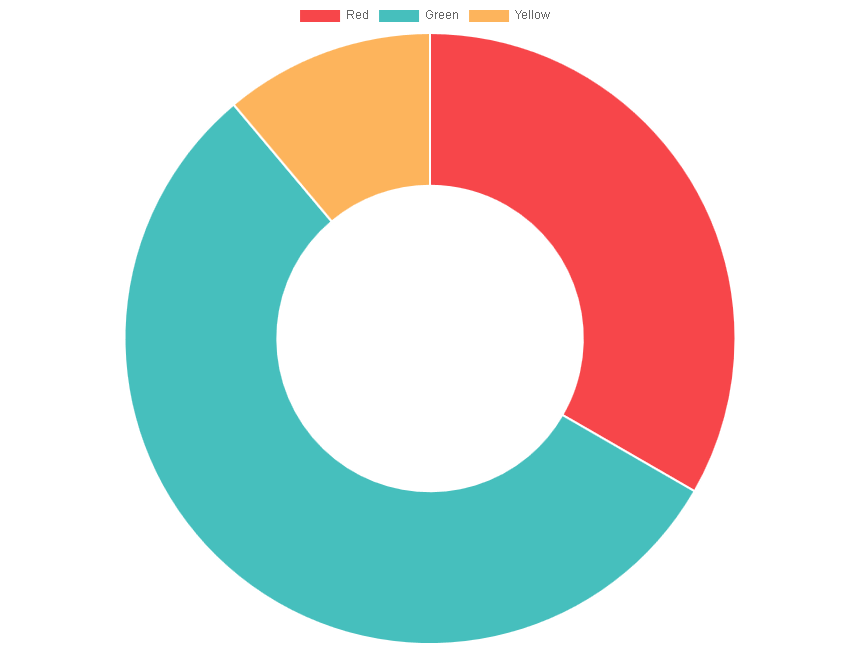

..  include:: ../../../../Includes.txt

..  _doughnutViewHelper:

:navigation-title: chart.doughnut

======================================
Doughnut ViewHelper <c:chart.doughnut>
======================================

ViewHelper to include a doughnut chart with `Charts.js`.

Go to the source code of this ViewHelper: 
`DoughnutViewHelper.php
<https://github.com/YolfTypo3/SavCharts/blob/main/Classes/ViewHelpers/Chart/DoughnutViewHelper.php>`_ (GitHub). 

Quick Test
==========

..  code-block:: xml 
    
    <c:template id="1">
    EXT:sav_charts/Resources/Private/Templates/ChartsExamples/FluidParser/DoughnutChart.fluid"
    </c:template>

Arguments
=========

..  confval:: id
    :name: doughnutId
    :Type: string
    :required: true
    
    Chart ID    

..  confval:: data
    :name: doughnutData
    :Type: mixed
    :required: true

    Data, or a reference to data
    
..  confval:: options
    :name: doughnutOptions
    :Type: mixed
    
    Options, or a reference to options    
    
..  confval:: width
    :name: doughnutWidth
    :Type: string
    :Default: 600

    Width value, or a reference to the width value
        
..  confval:: height
    :name: doughnutHeight
    :Type: string
    :Default: 400

    Height value, or a reference to the height value

Examples
========

Defining a Doughnut Chart
-------------------------

..  code-block:: xml    

    <c:charts>
        <c:chart.doughnut id="1" data="data__doughnutChartData" options="data__doughnutChartOptions" >
            ...
        </c:chart.doughnut>
    </c:charts>
    