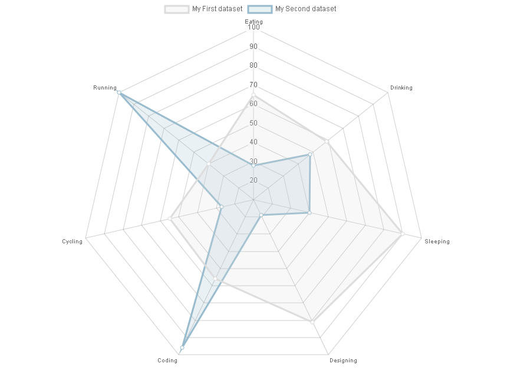

..  include:: ../../../../Includes.txt

..  _radarViewHelper:

:navigation-title: chart.radar

================================
Radar ViewHelper <c:chart.radar>
================================

ViewHelper to include a radar chart.

Go to the source code of this ViewHelper: 
`RadarViewHelper.php
<https://github.com/YolfTypo3/SavCharts/blob/main/Classes/ViewHelpers/Chart/RadarViewHelper.php>`_ (GitHub). 

Quick Test
==========

..  code-block:: xml 
    
    <c:template id="1">
    EXT:sav_charts/Resources/Private/Templates/ChartsExamples/FluidParser/RadarChart.fluid"
    </c:template>

    
Arguments
=========

..  confval:: id
    :name: radarId
    :Type: string
    :required: true
    
    Chart ID    

..  confval:: data
    :name: radarData
    :Type: mixed
    :required: true

    Data, or a reference to data
    
..  confval:: options
    :name: radarOptions
    :Type: mixed
    
    Options, or a reference to options    
    
..  confval:: width
    :name: radarWidth
    :Type: string
    :Default: 600

    Width value, or a reference to the width value
        
..  confval:: height
    :name: radarHeight
    :Type: string
    :Default: 400

    Height value, or a reference to the height value

Examples
========

Defining a Radar Chart
----------------------

..  code-block:: xml    

    <c:charts>
        <c:chart.radar id="1" data="data__radarChartData" options="data__radarChartOptions" >
            ...
        </c:chart.radar>
    </c:charts>
    
