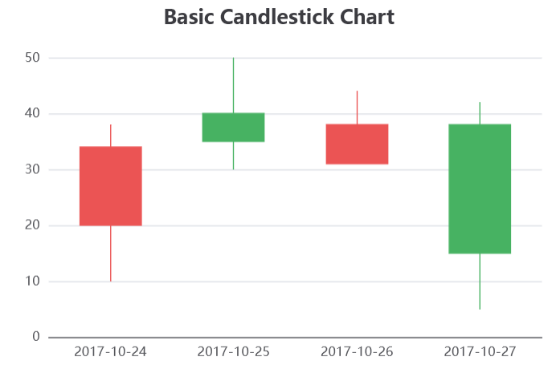

..  include:: ../../../../Includes.txt

..  _echart.candlestickViewHelper:

:navigation-title: echart.candlestick

=============================================
Candlestick ViewHelper <c:echart.candlestick>
=============================================

ViewHelper to include a candlestick chart with `Apache ECharts`.

Go to the source code of this ViewHelper: 
`CandlestickViewHelper.php
<https://github.com/YolfTypo3/SavCharts/blob/main/Classes/ViewHelpers/EChart/CandlestickViewHelper.php>`_ (GitHub). 

Quick Test
==========

..  code-block:: xml 
    
    <c:template id="1">
    EXT:sav_charts/Resources/Private/Templates/EChartsExamples/CandlestickChart.fluid"
    </c:template>

Arguments
=========

..  confval:: id
    :name: echart.candlestickId
    :Type: string
    :required: true
    
    Chart ID    
    
..  confval:: options
    :name: echart.candlestickOptions
    :Type: mixed
    :required: true
    
    Options, or a reference to options    
    
..  confval:: width
    :name: echart.candlestickWidth
    :Type: string
    :Default: 600

    Width value, or a reference to the width value
        
..  confval:: height
    :name: echart.candlestickHeight
    :Type: string
    :Default: 400

    Height value, or a reference to the height value

Examples
========

Defining a Candlestick Chart
----------------------------

..  code-block:: xml    

    <c:echarts>
        <c:echart.candlestick id="1" options="data__candlestickChartOptions" >
            ...
        </c:echart.candlestick>
    </c:echarts>
    