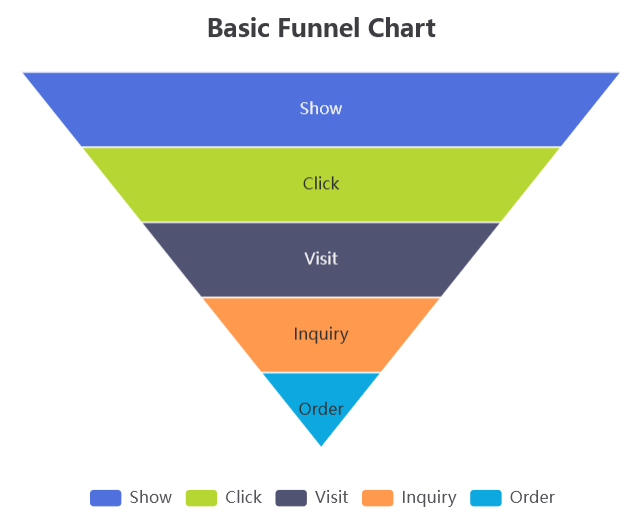

..  include:: ../../../../Includes.txt

..  _echart.funnelViewHelper:

:navigation-title: echart.funnel

===================================
Funnel ViewHelper <c:echart.funnel>
===================================

ViewHelper to include a funnel chart with `Apache ECharts`.

Go to the source code of this ViewHelper: 
`FunnelViewHelper.php
<https://github.com/YolfTypo3/SavCharts/blob/main/Classes/ViewHelpers/EChart/FunnelViewHelper.php>`_ (GitHub). 

Quick Test
==========

..  code-block:: xml 
    
    <c:template id="1">
    EXT:sav_charts/Resources/Private/Templates/EChartsExamples/FunnelChart.fluid"
    </c:template>

Arguments
=========

..  confval:: id
    :name: echart.funnelId
    :Type: string
    :required: true
    
    Chart ID    
    
..  confval:: options
    :name: echart.funnelOptions
    :Type: mixed
    :required: true
    
    Options, or a reference to options    
    
..  confval:: width
    :name: echart.funnelWidth
    :Type: string
    :Default: 600

    Width value, or a reference to the width value
        
..  confval:: height
    :name: echart.funnelHeight
    :Type: string
    :Default: 400

    Height value, or a reference to the height value

Examples
========

Defining a Funnel Chart
-----------------------

..  code-block:: xml    

    <c:echarts>
        <c:echart.funnel id="1" options="data__funnelChartOptions" >
            ...
        </c:echart.funnel>
    </c:echarts>
    