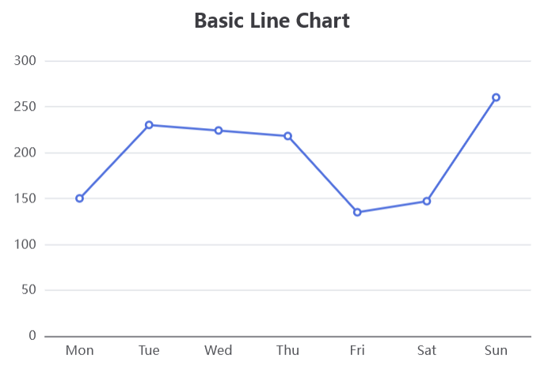

..  include:: ../../../../Includes.txt

..  _echart.lineViewHelper:

:navigation-title: echart.line

===============================
Line ViewHelper <c:echart.line>
===============================

ViewHelper to include a line chart with `Apache ECharts`.

Go to the source code of this ViewHelper: 
`LineViewHelper.php
<https://github.com/YolfTypo3/SavCharts/blob/main/Classes/ViewHelpers/EChart/LineViewHelper.php>`_ (GitHub). 

Quick Test
==========

..  code-block:: xml 
    
    <c:template id="1">
    EXT:sav_charts/Resources/Private/Templates/EChartsExamples/LineChart.fluid"
    </c:template>

Arguments
=========

..  confval:: id
    :name: echart.lineId
    :Type: string
    :required: true
    
    Chart ID    
    
..  confval:: options
    :name: echart.lineOptions
    :Type: mixed
    :required: true
    
    Options, or a reference to options    
    
..  confval:: width
    :name: echart.lineWidth
    :Type: string
    :Default: 600

    Width value, or a reference to the width value
        
..  confval:: height
    :name: echart.lineHeight
    :Type: string
    :Default: 400

    Height value, or a reference to the height value

Examples
========

Defining a Line Chart
---------------------

..  code-block:: xml    

    <c:echarts>
        <c:echart.line id="1" options="data__lineChartOptions" >
            ...
        </c:echart.line>
    </c:echarts>
    