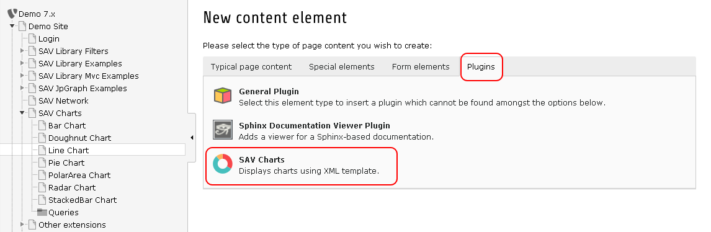
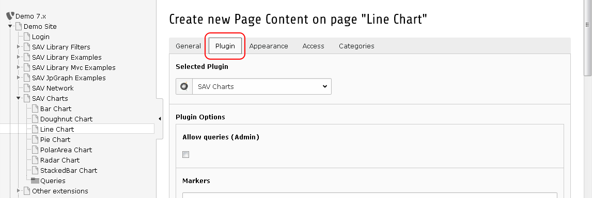
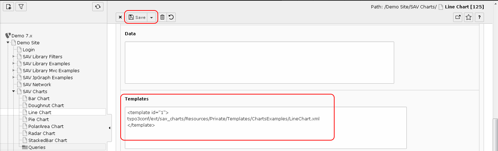
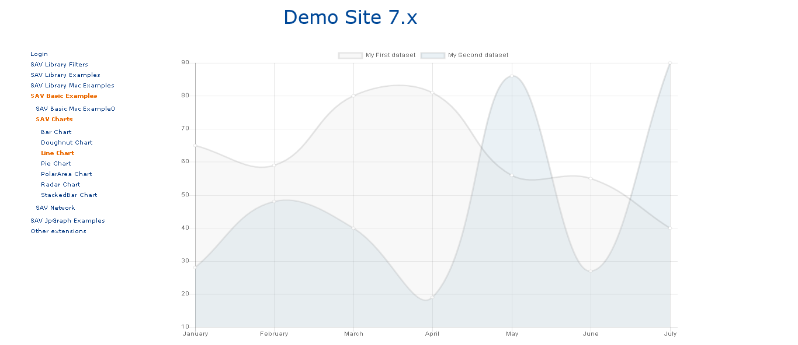
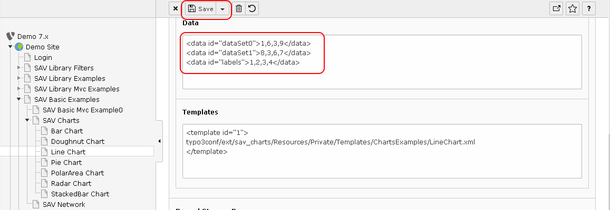
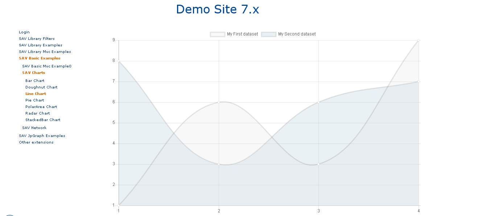
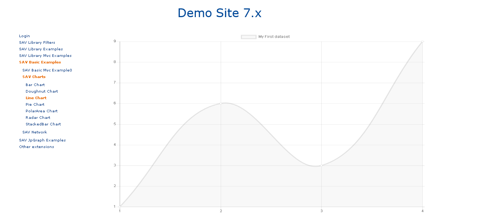
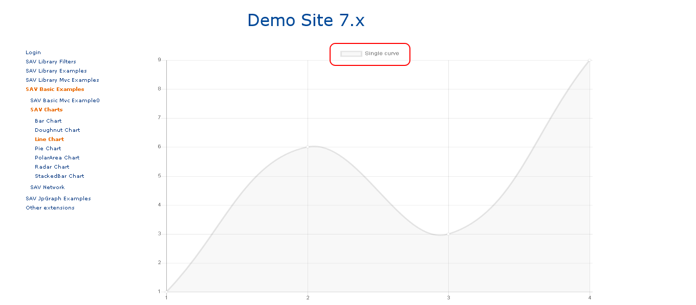
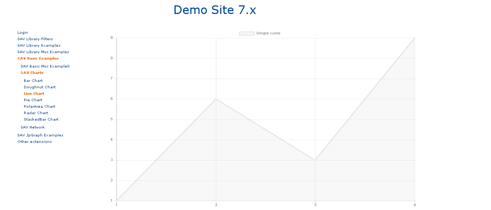

.. include:: ../../Includes.txt

.. _designingXmlTemplatesFromExamples:

=====================================
Designing XML Templates From Examples
=====================================

Introduction
============

The `charts.js documentation <https://www.chartjs.org/docs/>`_ provides 
examples for the different charts. 

The SAV Charts extension comes with templates for all chart types. 
These templates are in the directory
``Resources/Private/Templates/ChartExamples`` of the extension.

To display a template, simply create a SAV Charts plugin content element in a page. 

Then click on the plugin tab.

Fill the template field of the flexform and save.

Go to the frontend and you should see the following image.

Writing Templates
=================

The templates provided with the extension were adpated from the 
examples given in the `charts.js documentation <https://www.chartjs.org/docs/>`_.
Let us illustrate the principle for the line chart.

The javascript code to display the line graph is the following:

.. code::

   var data = {
      labels: ["January", "February", "March", "April", "May", "June", "July"],
      datasets: [
         {
            label: "My First dataset",
            fillColor: "rgba(220,220,220,0.2)",
            strokeColor: "rgba(220,220,220,1)",
            pointColor: "rgba(220,220,220,1)",
            pointStrokeColor: "#fff",
            pointHighlightFill: "#fff",
            pointHighlightStroke: "rgba(220,220,220,1)",
            data: [65, 59, 80, 81, 56, 55, 40]
         },
         {
            label: "My Second dataset",
            fillColor: "rgba(151,187,205,0.2)",
            strokeColor: "rgba(151,187,205,1)",
            pointColor: "rgba(151,187,205,1)",
            pointStrokeColor: "#fff",
            pointHighlightFill: "#fff",
            pointHighlightStroke: "rgba(151,187,205,1)",
            data: [28, 48, 40, 19, 86, 27, 90]
         }
      ]
   };

The template is built by transforming this javascript code into a 
XML structure using the ``<data>`` tag. By doing so, thanks to the 
data tag id, references can be used.
References provide an easy means to split the data and therefore 
to make it possible to have them overloaded in the flexform data section or with queries.

The following code is the translation in XML of the previous 
javascript code where ``<data>`` tags whose id are ``labels``, ``dataSet1`` and ``dataSet2``
can be easily overloaded as explained in the next section.

.. code::

   <?xml version="1.0" encoding="UTF-8"?>
   <charts>        
      <lineChart id="1" data="data#lineChartData" options="data#lineChartOptions" >
                
         <marker id="labelSet0">My First dataset</marker>
         <marker id="labelSet1">My Second dataset</marker>       
            
         <data id="labels">
            January, February, March, April, May, June, July
         </data>
        
         <data id="dataSet0">
            65, 59, 80, 81, 56, 55, 40
         </data>
            
         <data id="dataSet1">
            28, 48, 40, 19, 86, 27, 90
         </data>         
        
         <data id="set0">
            <item key="label" value="marker#labelSet0" />
            <item key="backgroundColor">rgba(220,220,220,0.2)</item>
            <item key="pointColor">rgba(220,220,220,1)</item>
            <item key="pointBackgroundColor">#fff</item>
            <item key="pointHoverBackgroundColor">rgba(220,220,220,1)</item>
            <item key="data" value="data#dataSet0" />
         </data> 
        
         <data id="set1">
            <item key="label" value="marker#labelSet12" />
            <item key="backgroundColor">rgba(151,187,205,0.2)</item>
            <item key="pointColor">rgba(151,187,205,1)</item>
            <item key="pointBackgroundColor">#fff</item>
            <item key="pointHoverBackgroundColor">rgba(151,187,205,1)</item>            
            <item key="data" value="data#dataSet1" />
         </data>     
        
         <data id="dataSets">
            <item key="0" value="data#set0" />
            <item key="1" value="data#set1" />
         </data>     
        
         <data id="lineChartData">
            <item key="labels" value="data#labels" />           
            <item key="datasets" value="data#dataSets" />       
         </data> 
            
         <data id="lineChartOptions">
         </data>     
            
      </lineChart>
   </charts>

.. tip::
    
   ``<data>`` were inserted inside the ``<lineChart>`` tag just by personal choice. 
   They could have been provided before 
   the ``<lineChart>`` tag. In that case, this tag would have no content 
   and would simply be written:
    
   .. code::
    
      <lineChart id="1" data="data#lineChartData" options="data#lineChartOptions" />
 
Overloading Data
================

Open the plugin in the backend and fill the Data section of the flexform 
as follows and save:

Go in the frontend and you should see the following figure.

The principle in SAV Charts is to consider that for a given tag 
with a given id the first definition is the first one to use. Therefore, in the
previous example, since <data> tag for id ``dataSet0`` and ``dataSet1`` 
are defined in the data section, which is 
before the template section, they will not be replaced by the 
same ``<data>`` tags in the template. One may consider 
that the ``<data>`` tags in the data section overloads the same tags in the template. 

It provides a quite simple way of working with generic templates and 
adapting their behavior with your real data.
For example, using the same template ``LineChart.xml``, you may want 
to display only one curve.
It can simply be done by defining the ``<data>`` tag whose id is 
``dataSets`` in the data section as shown below.

.. code::

   <data id="dataSet0">1,6,3,9</data>
   <data id="labels">1,2,3,4</data>
      <data id="dataSets">
         <item key="0" value="data#set0" />
   </data>   
    
Enter the previous code in the flexform data section, save and go to the frontend.

.. note::

   In very specific cases you may explicitly allow to overload a given tag 
   by setting the attribute overload to 1. See  
   ``Resources/Private/Templates/ChartExamples/LineChartAdvanced.xml`` in which this 
   feature is used to build a flexible template.

Overloading Markers
===================

Markers are tags which can be used to create strings. In the line chart 
template two markers are used to define labels
which are displayed in the legend. The markers can be overloaded in the 
``Markers`` section of the flexform. Assuming that you have
the previous code to display only one line chart, input the following code in 
the ``Markers`` sections, save and go to the frontend.

.. code::

   <marker id="labelSet0">Single curve</marker>
    

Options
=======

Options are defined in the charts.js documentation. They can be set by 
overloading the ``<data>`` tag associated with the options
attribute of the chart. For example, in the ``LineChart.xml`` template, 
the chart is defined as follows: 

.. code::

   <lineChart id="1" data="data#lineChartData" options="data#lineChartOptions" >
      ....
   </lineChart>  

The ``options`` attribute is a reference to the ``<data>`` tag whose id is ``lineChartOptions``.

Overloading this tag in the ``Data`` section of the flexform will set options.

Let us assume that the data section is still configure for a single chart, 
with a modifed label.

Add the following code in the ``Data`` section of the flexform. It will cancel the animation, 
set a linear interpolation between points.

.. code::

   <data id="lineChartOptions" >
      <item key="animation"></item>
      <item key="elements">
         <item key="line">
            <item key="tension" value="0" />
         </item>
      </item>
   </data>  

.. note::

   A linear interpolation is obtained by setting tension to 0 in 
   ``Chart.defaults.global.elements.line`` 
   (see `charts.js documentation <https://www.chartjs.org/docs/>`_). 
   Since the global option are in the ``<data>`` 
   whose id is ``lineChartOptions``, nested items whose 
   keys are ``elements`` and ``line`` provide acces to ``Chart.defaults.global.elements.line``.

.. tip::

   To generate a boolean value, set the attribute ``value`` to ``true`` or ``false``.

  