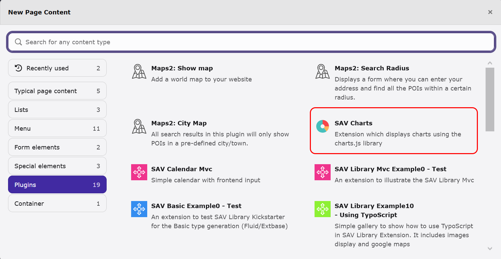
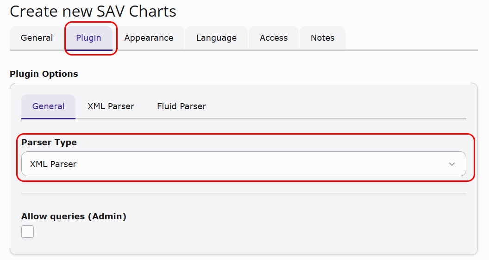
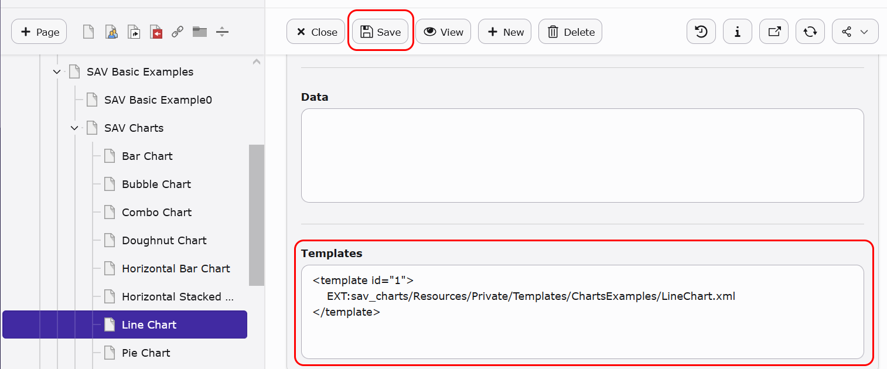
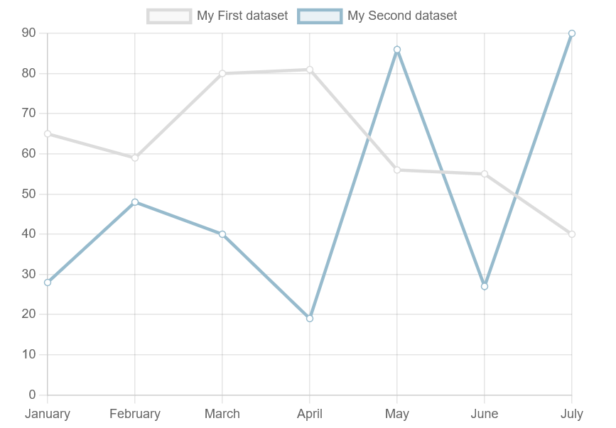
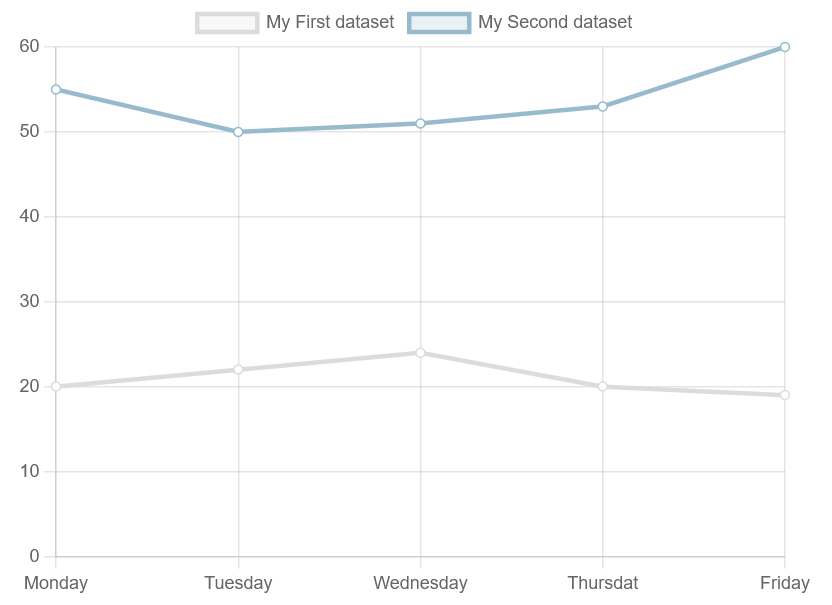
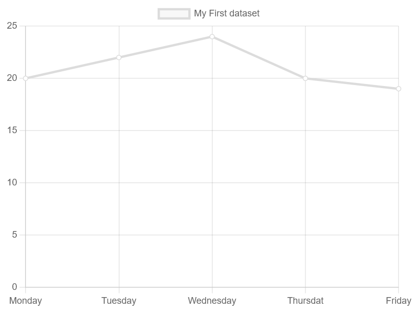
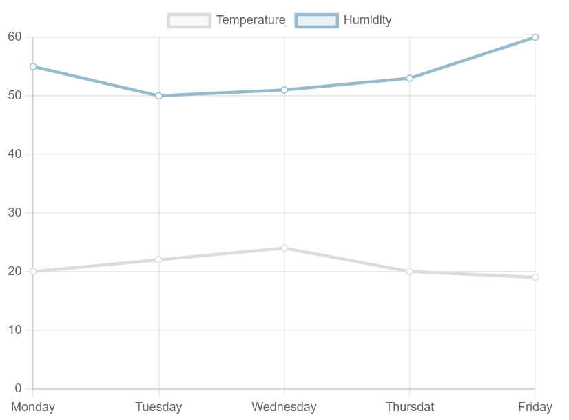
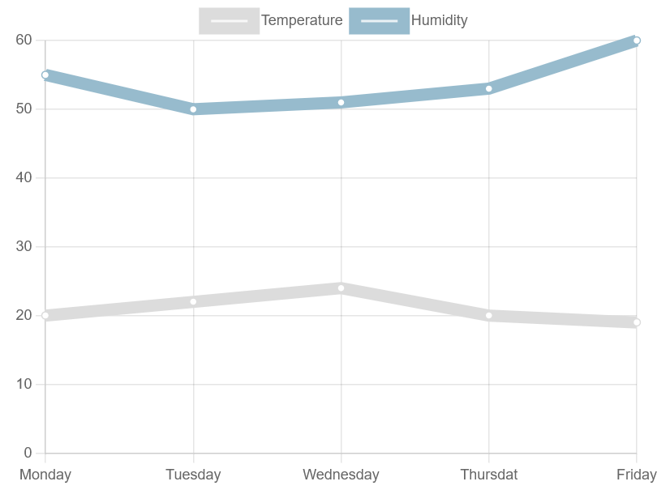

..  include:: ../../../Includes.txt

..  _designingTemplatesFromExamples:

=================================
Designing Templates From Examples
=================================

Introduction
============

The `Chart.js documentation <https://www.chartjs.org/docs/>`_ provides 
examples of various chart types. 

The SAV Charts extension includes templates for all chart types. 
These templates can be found in 
`Resources/Private/Templates/ChartExamples` for the XML parser
and `Resources/Private/Templates/ChartExamples/FluidParser` for the Fluid
parser.

To display a template, simply create an SAV Charts 
plugin content element on a page.

Then click on the plugin tab and select the parser type.

Fill in the template field of the Flexform corresponding to the selected parser type, then save.

..  important::

    Use the EXT: prefix to reference the template file from the extension. 

    ..  tabs::

        ..  tab:: XML Parser

            ..  code-block:: xml
    
                <template id="1">
                    EXT:sav_charts/Resources/Private/Templates/ChartsExamples/LineChart.xml
                </template> 
                
        ..  tab:: Fluid Parser

            ..  code-block:: xml
    
                <c:template id="1">
                    EXT:sav_charts/Resources/Private/Templates/ChartsExamples/FluidParser/LineChart.fluid
                </c:template>                 

            or     

            ..  code-block:: xml
                
                <c:template id="1" fileName="EXT:sav_charts/Resources/Private/Templates/ChartsExamples/FluidParser/LineChart.fluid" />

Go to the front-end and you should see the following image.

Writing Templates
=================

The templates provided with the extension were 
adapted from the examples given in the 
`Chart.js documentation <https://www.chartjs.org/docs/>`_.
Let us illustrate the principle for the line chart.

The JavaScript code to display the line graph is 
as follows:

..  code-block:: javascript

    var data = {
        labels: ["January", "February", "March", "April", "May", "June", "July"],
        datasets: [
            {
                label: "My First dataset",
                fillColor: "rgba(220,220,220,0.2)",
                strokeColor: "rgba(220,220,220,1)",
                pointColor: "rgba(220,220,220,1)",
                pointStrokeColor: "#fff",
                pointHighlightFill: "#fff",
                pointHighlightStroke: "rgba(220,220,220,1)",
                data: [65, 59, 80, 81, 56, 55, 40]
            },
            {
                label: "My Second dataset",
                fillColor: "rgba(151,187,205,0.2)",
                strokeColor: "rgba(151,187,205,1)",
                pointColor: "rgba(151,187,205,1)",
                pointStrokeColor: "#fff",
                pointHighlightFill: "#fff",
                pointHighlightStroke: "rgba(151,187,205,1)",
                data: [28, 48, 40, 19, 86, 27, 90]
            }
        ]
    };

The template is created by converting the JavaScript
code into an XML structure with the data tag. 
Thanks to the data tag ID, references can be used
and applied.
These references provide an easy way to split the
data, making it possible to overload them in the
FlexForm data section or with queries.

The following codes are the XML or Fluid translations of the
previous JavaScript code. Data tags with the IDs
"labels," "dataSet1," and "dataSet2" can be easily
overloaded, as explained in the next section.

..  tabs::

    ..  tab:: XML Parser

        ..  code-block:: xml

            <?xml version="1.0" encoding="UTF-8"?>
            <charts>        
                <lineChart id="1" data="data#lineChartData" options="data#lineChartOptions" >
    
                    <marker id="labelSet0">My First dataset</marker>
                    <marker id="labelSet1">My Second dataset</marker>       
    
                    <data id="labels">
                        January, February, March, April, May, June, July
                    </data>
    
                    <data id="dataSet0">
                        65, 59, 80, 81, 56, 55, 40
                    </data>
                
                    <data id="dataSet1">
                        28, 48, 40, 19, 86, 27, 90
                    </data>         
            
                    <data id="set0">
                        <item key="label" value="marker#labelSet0" />
                        <item key="backgroundColor">rgba(220,220,220,0.2)</item>
                        <item key="pointColor">rgba(220,220,220,1)</item>
                        <item key="pointBackgroundColor">#fff</item>
                        <item key="pointHoverBackgroundColor">rgba(220,220,220,1)</item>
                        <item key="data" value="data#dataSet0" />
                    </data> 
    
                    <data id="set1">
                        <item key="label" value="marker#labelSet12" />
                        <item key="backgroundColor">rgba(151,187,205,0.2)</item>
                        <item key="pointColor">rgba(151,187,205,1)</item>
                        <item key="pointBackgroundColor">#fff</item>
                        <item key="pointHoverBackgroundColor">rgba(151,187,205,1)</item>            
                        <item key="data" value="data#dataSet1" />
                    </data>     
            
                    <data id="dataSets">
                        <item key="0" value="data#set0" />
                        <item key="1" value="data#set1" />
                    </data>     
            
                    <data id="lineChartData">
                        <item key="labels" value="data#labels" />           
                        <item key="datasets" value="data#dataSets" />       
                    </data> 
                
                    <data id="lineChartOptions">
                    </data>     
                
                </lineChart>
            </charts>

    ..  tab:: Fluid parser

        ..  code-block:: xml

            <c:charts>        
                <c:lineChart id="1" data="data__lineChartData" options="data__lineChartOptions" >
    
                    <c:marker id="labelSet0">My First dataset</c:marker>
                    <c:marker id="labelSet1">My Second dataset</c:marker>       
    
                    <c:data id="labels">
                        January, February, March, April, May, June, July
                    </c:data>
    
                    <c:data id="dataSet0">
                        65, 59, 80, 81, 56, 55, 40
                    </c:data>
    
                    <c:data id="dataSet1">
                        28, 48, 40, 19, 86, 27, 90
                    </c:data>         
    
                    <c:data id="set0">
                        <c:item key="label" value="{marker__labelSet0}" />
                        <c:item key="backgroundColor">rgba(220,220,220,0.2)</c:item>
                        <c:item key="pointColor">rgba(220,220,220,1)</c:item>
                        <c:item key="pointBackgroundColor">#fff</c:item>
                        <c:item key="pointHoverBackgroundColor">rgba(220,220,220,1)</c:item>
                        <c:item key="data" value="{data__dataSet0}" />
                    </c:data> 
    
                    <c:data id="set1">
                        <c:item key="label" value="{marker__labelSet1}" />
                        <c:item key="backgroundColor">rgba(151,187,205,0.2)</c:item>
                        <c:item key="pointColor">rgba(151,187,205,1)</c:item>
                        <c:item key="pointBackgroundColor">#fff</c:item>
                        <c:item key="pointHoverBackgroundColor">rgba(151,187,205,1)</c:item>            
                        <c:item key="data" value="{data__dataSet1}" />
                    </c:data>     
    
                    <c:data id="dataSets">
                        <c:item key="0" value="{data__set0}" />
                        <c:item key="1" value="{data__set1}" />
                    </c:data>     
    
                    <c:data id="lineChartData">
                        <c:item key="labels" value="{data__labels}" />           
                        <c:item key="datasets" value="{data__dataSets}" />       
                    </c:data> 
                
                    <c:data id="lineChartOptions">
                    </c:data>     
    
                </c:lineChart>
            </c:charts>

..  tip::
    
    `<data>` were inserted inside the `<lineChart>`
    tag just by personal choice. 
    They could have been provided before 
    the `<lineChart>` tag. In that case, the tag
    would have no content and would simply be written
    as follows:

    ..  tabs::
    
        ..  tab:: XML Parser
    
            ..  code-block:: xml    
    
                <lineChart id="1" data="data#lineChartData" options="data#lineChartOptions" />

        ..  tab:: Fluid Parser
    
            ..  code-block:: xml    
    
                <c:lineChart id="1" data="data__lineChartData" options="data__lineChartOptions" />

Overloading Data
================

Open the plugin in the backend, fill out the `Data`
section of the Flexform as follows, and then save.

..  tabs::

    ..  tab:: XML Parser

        ..  code-block:: xml    

            <data id="dataSet0">
                20,22,24,20,19
            </data>
            <data id="dataSet1">
                55,50,51,53,60
            </data>
            <data id="labels">
                Monday, Tuesday, Wednesday, Thursdat, Friday            
            </data>
                        
    ..  tab:: Fluid Parser

        ..  code-block:: xml    

            <c:data id="dataSet0">
                20,22,24,20,19
            </c:data>
            <c:data id="dataSet1">
                55,50,51,53,60
            </c:data>
            <c:data id="labels">
                Monday, Tuesday, Wednesday, Thursdat, Friday            
            </c:data>

Go in the front-end and you should see the following figure.

In SAV Charts, the principle is that the first 
definition is used for a given tag with a given ID. 
In the previous example, for instance, 
the `dataSet0` and `dataSet1` tags are defined in 
the data section before the template section. 
Consequently, they will not be replaced by the 
same data tags in the template. 
The tags in the data section overload the same 
tags in the template. 

This provides a simple way to work with generic 
templates and adapt their behavior to your data.
For example, with the same "LineChart.xml" 
template, you may want to display only one curve.
This can easily be achieved by defining the 
"dataSets" tag in the data section, as shown 
below.

..  tabs::

    ..  tab:: XML Parser

        ..  code-block:: xml

            <data id="dataSet0">
                20,22,24,20,19
            <data>
            <data id="labels">
                Monday, Tuesday, Wednesday, Thursdat, Friday            
            <data>
            <data id="dataSets">
                <item key="0" value="data#set0" />
            </data>   

    ..  tab:: Fluid Parser

        ..  code-block:: xml

            <c:data id="dataSet0">
                20,22,24,20,19
            <c:data>
            <c:data id="labels">
                Monday, Tuesday, Wednesday, Thursdat, Friday            
            <c:data>
            <c:data id="dataSets">
                <c:item key="0" value="{data__set0}" />
            </c:data> 
    
Enter the previous code in the FlexForm Data section.
Then, save and go to the front end.

..  note::

    In very specific cases, you can explicitly allow 
    overloading of a given tag by setting the Overload attribute
    to 1. This feature is used to build a flexible XML template in the file 
    `Resources/Private/Templates/ChartExamples/LineChartAdvanced.xml`.

Overloading Markers
===================

Markers are tags that can be used to create strings. 
In the line chart template, two markers are used 
to define the labels that are displayed in the legend. 
You can overlay the markers in the `Markers` section
of the Flexform. Enter the following code in 
the `Markers` and `Data` sections. Then, save and go to 
the front-end.

..  tabs::

    ..  tab:: XML Parser

        Markers section
        
        ..  code-block:: xml

            <marker id="labelSet0">Temperature</marker>
            <marker id="labelSet1">Humidity</marker>

        Data section
        
        ..  code-block:: xml
                    
            <data id="dataSet0">
                20,22,24,20,19
            </data>
            <data id="dataSet1">
                55,50,51,53,60
            </data>
            <data id="labels">
                Monday, Tuesday, Wednesday, Thursdat, Friday            
            </data>        

    ..  tab:: Fluid Parser

        Markers section
        
        ..  code-block:: xml

            <c:marker id="labelSet0">Temperature</c:marker>
            <c:marker id="labelSet1">Humidity</c:marker>

        Data section
        
        ..  code-block:: xml
                    
            <c:data id="dataSet0">
                20,22,24,20,19
            </c:data>
            <c:data id="dataSet1">
                55,50,51,53,60
            </c:data>
            <c:data id="labels">
                Monday, Tuesday, Wednesday, Thursdat, Friday            
            </c:data>   

                

Options
=======

Options are defined in the Chart.js documentation. They can be set by 
overloading the `<data>` tag associated with the options
attribute of the chart.  
In the `LineChart.xml` template, for example, the chart
is defined as follows:
 
..  tabs::

    ..  tab:: XML Parser
    
        ..  code-block:: xml

            <lineChart id="1" data="data#lineChartData" options="data#lineChartOptions" >
                ....
            </lineChart>  

    ..  tab:: Fluid Parser
    
        ..  code-block:: xml

            <c:lineChart id="1" data="data__lineChartData" options="data__lineChartOptions" >
                ....
            </c:lineChart> 

The `options` attribute is a reference to the
`<data>` tag whose ID is `lineChartOptions`.

Overloading this tag in the `Data` section of the 
Flexform will set the options.
Assume that the `Data` section is still configured
with a modified label.
Add the following code to the `Data` section 
of the Flexform. This will cancel the animation,
set a linear interpolation between points, and display
the line a width of 10 points.

..  tabs::

    ..  tab:: XML Parser
    
        ..  code-block:: xml

            <data id="lineChartOptions" >
                <item key="animation"></item>
                <item key="elements">
                    <item key="line">
                        <item key="tension" value="0" />
                        <item key="borderWidth" value="10" />
                    </item>
                </item>
            </data>  

    ..  tab:: Fluid Parser
    
        ..  code-block:: xml

            <c:data id="lineChartOptions" >
                <c:item key="animation"></c:item>
                <c:item key="elements">
                    <c:item key="line">
                        <c:item key="tension" value="0" />
                        <c:item key="borderWidth" value="10" />
                    </c:item>
                </c:item>
            </c:data>  

..  note::

    A linear interpolation is obtained by setting the 
    tension to 0 in `Chart.defaults.global.elements.line` 
    (see `Chart.js documentation <https://www.chartjs.org/docs/>`_). 
    Since the global options are in the `<data>` 
    whose ID is `lineChartOptions`, nested items whose 
    keys are `elements` and `line` provide 
    access to `Chart.defaults.global.elements.line`.

..  tip::

    To generate a Boolean value, set the attribute `value`
    to `true` or `false`.

  