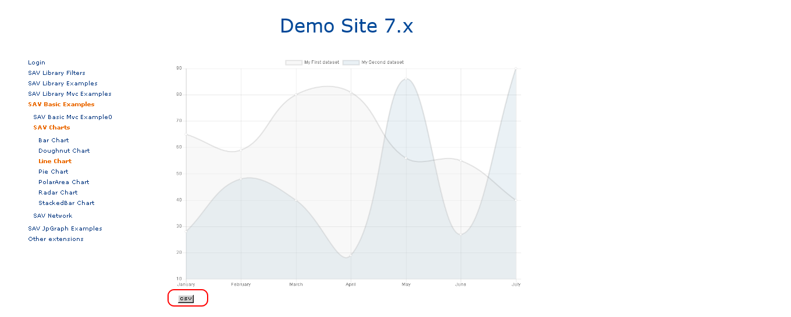

..  include:: ../../../Includes.txt

..  _exportingDataInCsv:
 
=====================
Exporting Data in CSV
=====================

You can easily export data associated with any chart using the exportCSV method 
associated with the `<charts>` tag (see :ref:`chart.exportCsv`).

Assuming that you want to export data associated with the line chart template with 
a row header containing the x-axis labels and a column header containing the legend labels of
the two curves. Add the following code to the `Templates` field of the Flexform.

..  tabs::

    ..  tab:: XML Parser
    
        ..  code-block:: xml
    
            <template id="1">
                EXT:sav_charts/Resources/Private/Templates/ChartsExamples/LineChart.xml
            </template>
            
            <data id="data">
              <item key="0" value="data#dataSet0" />
              <item key="1" value="data#dataSet1" />    
            </data>
            
            <data id="exportRowHeader">
              <item key="0" value="marker#labelSet0" />
              <item key="1" value="marker#labelSet1" />
            </data>
                            
            <exportCSV reference="lineChart#1" rowHeader="data#exportRowHeader" columnHeader="data#labels" data="data#data" />

    ..  tab:: Fluid Parser
    
        ..  code-block:: xml
    
            <c:template id="1">
                EXT:sav_charts/Resources/Private/Templates/ChartsExamples/FluidParser/LineChart.fluid
            </c:template>
            
            <c:data id="data">
              <c:item key="0" value="{data__dataSet0}" />
              <c:item key="1" value="{data__dataSet1}" />   
            </c:data>
            
            <c:data id="exportRowHeader">
              <c:item key="0" value="{marker__labelSet0}" />
              <c:item key="1" value="{marker__labelSet1}" />
            </c:data>
        
            <c:exportCSV fileName="LineChart_1.csv" rowHeader="{data__exportRowHeader}" columnHeader="{data__labels}" data="{data__data}" />             

The CSV file is saved in `typo3temp/sav_charts`.

With the XML parser, the file name is 
`img_ContentId_ChartNumber`, where ContentId 
is the UID of the content element and ChartNumber 
is the ID of the chart, starting from 0. 
In the front-end you should see an icon to open the file.

            
With the Fluid parser, the file name is
provided in the argument `fileName`. 

..  note::
    
    No icon is displayed in the front-end.

