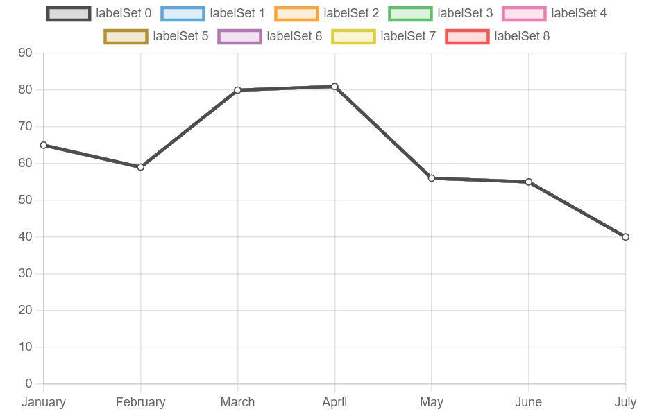
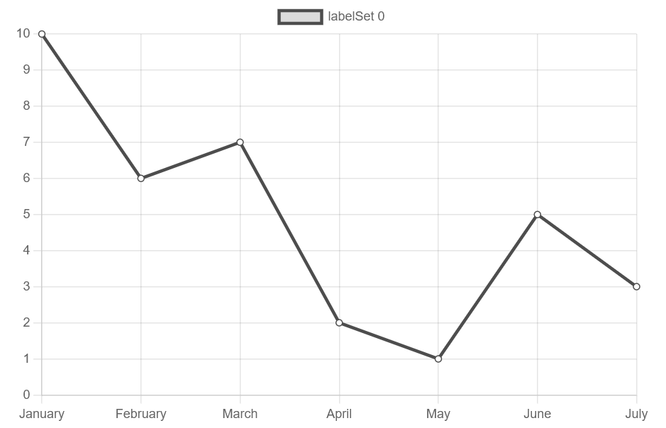
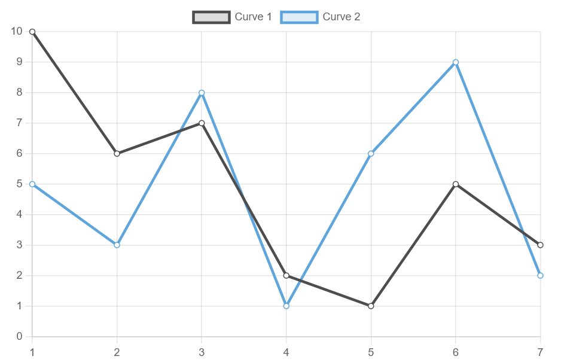

..  include:: ../../../Includes.txt

..  _usingAdvancedTemplates:

========================
Using Advanced Templates
========================

SAV Charts provides more complex templates. 
They can display up to nine items on the same 
chart.

The colors are defined in a specific template, 
either `DefaultColors.xml` for the XML parser 
or `FluidParser/DefaultColors.fluid` for the 
Fluid parser. These colors were chosen to 
provide contrast between items.

To illustrate the use of advanced templates,
consider the `LineChartAdvanced.xml` template or 
the `FluidParser/LineChartAdvanced.fluid` 
template.

Enter the following code in the template section,
then save and go to the front end.

..  tabs::

    ..  tab:: XML Parser

        ..  code-block:: xml
        
            <template id="1">
                EXT:sav_charts/Resources/Private/Templates/ChartsExamples/LineChartAdvanced.xml
            </template>  

    ..  tab:: Fluid Parser

        ..  code-block:: xml
        
            <c:template id="1">
                EXT:sav_charts/Resources/Private/Templates/ChartsExamples/FluidParser/LineChartAdvanced.fluid
            </c:template> 
    

The chart has nine superimposed curves with the 
same data, as well as predefined colors, labels, and a title. 
Click on the legend to hide a curve.

In the data section enter the following code, save, and go to 
the front-end.  

..  tabs::

    ..  tab:: XML Parser

        ..  code-block:: xml

            <data id="data">
                <item key="0" values="10, 6, 7, 2, 1, 5, 3" />     
            </data>  

    ..  tab:: Fluid Parser

        ..  code-block:: xml
            
            <c:data id="data">
                <c:item key="0" values="10, 6, 7, 2, 1, 5, 3" />     
            </c:data>              
                

 
Modify the data section as follows:

..  tabs::

    ..  tab:: XML Parser

        ..  code-block:: xml

            <data id="data">
                <item key="0" values="10, 6, 7, 2, 1, 5, 3" />
                <item key="1" values="5, 3, 8, 1, 6, 9, 2" />
            </data>  
            
            <data id="labels">
                1, 2, 3, 4, 5, 6, 7
            </data>

    ..  tab:: Fluid Parser

        ..  code-block:: xml            
            
            <c:data id="data">
                <c:item key="0" values="10, 6, 7, 2, 1, 5, 3" />
                <c:item key="1" values="5, 3, 8, 1, 6, 9, 2" />
            </c:data>  
            
            <c:data id="labels">
                1, 2, 3, 4, 5, 6, 7
            </c:data>
                            
Enter the following code in the marker section, then save and go to the front-end.

..  tabs::

    ..  tab:: XML Parser

        ..  code-block:: xml

            <marker id="title">A line chart with two curves</marker> 
            <marker id="labelSet0">Curve 1</marker> 
            <marker id="labelSet1">Curve 2</marker> 

    ..  tab:: Fluid Parser

        ..  code-block:: xml

            <c:marker id="title">A line chart with two curves</c:marker> 
            <c:marker id="labelSet0">Curve 1</c:marker> 
            <c:marker id="labelSet1">Curve 2</c:marker> 

 

