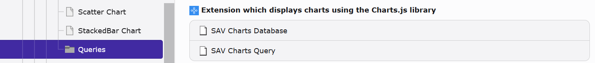
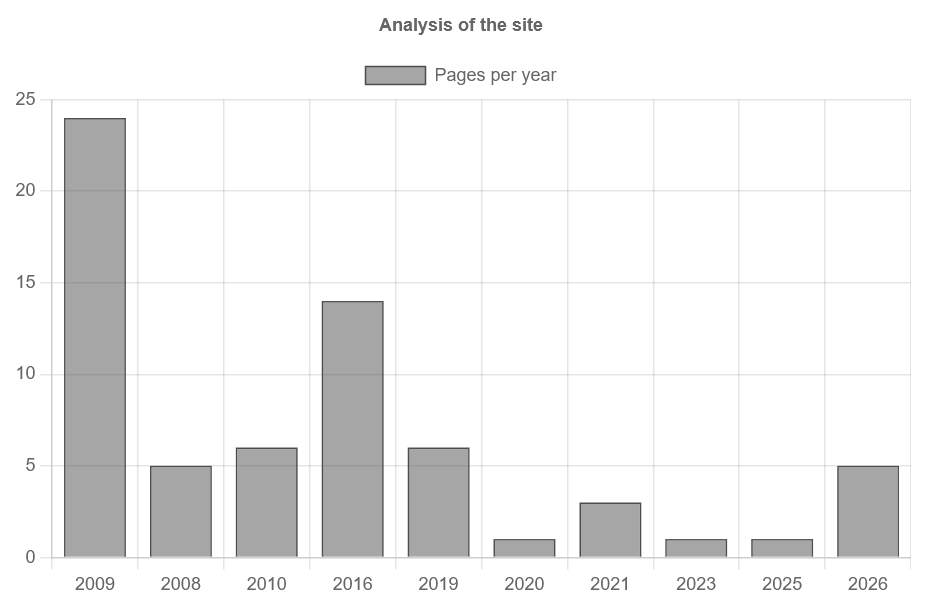
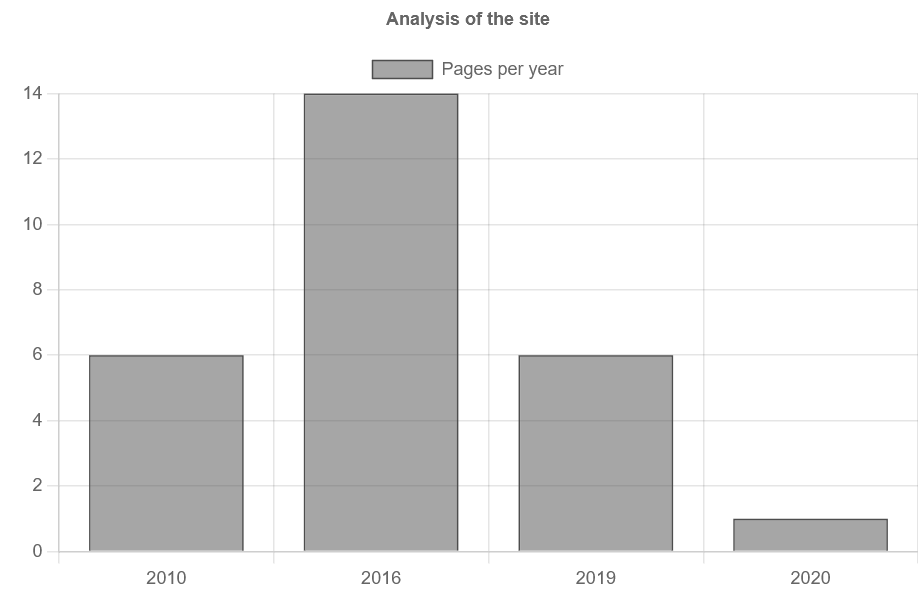
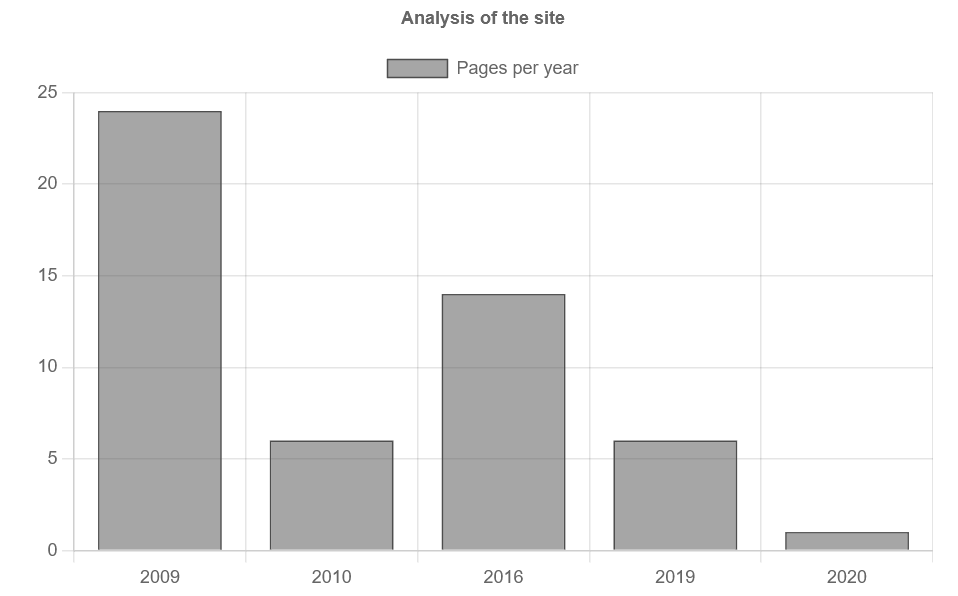

..  include:: ../../../Includes.txt

..  _usingAndDevelopingQueryManagers:

===================================
Using and Developing Query Managers
===================================

Query managers are used in <query> tags to execute
queries that can be used in charts.

The SAV Charts extension comes with an internal query 
manager named `savcharts` that can
handle TYPO3 database queries as well as queries 
from other databases.

Using the Query Manager
=======================

In the backend in `Records` mode create a new record 
in a page or a folder.

Select `Database` if you need to access to an external database, 
fill the different fields and save.

..  tip::

    You do not need to create a new database access if you only need 
    to access to the current TYPO3 database.

Select `Query` to create a query. Select a database (default is 
`TYPO3 Database`), fill the different clauses and save. 

The following configuration is an example of how to obtain the 
number of pages created per year.
    
-   In SELECT clause field

    ..  code-block:: sql

        COUNT(*) AS Count,
        YEAR(FROM_UNIXTIME(crdate)) AS Year

-   In FROM clause field

    ..  code-block:: sql  

        pages

-   In WHERE clause field

    ..  code-block:: sql

        NOT deleted AND NOT hidden

-   In GROUP BY clause field

    ..  code-block:: sql

        year
        
The following query is generated by this configuration.

..  code-block:: sql

    SELECT
        COUNT(*) AS Count,
        YEAR(FROM_UNIXTIME(crdate)) AS Year
    FROM
        pages
    WHERE
        NOT deleted AND NOT hidden
    GROUP BY
        Year

If the new query has ID 1, the following FlexForm
configurations will display a bar chart showing 
the number of pages per year. 

..  important::

    The flag `Allow queries (Admin)` must be set by an Admin user in the content 
    Flexform to execute queries.

-   In the Markers Flexform field

    ..  tabs::

        ..  tab:: XML Parser

            ..  code-block:: xml
                
                <marker id="title">Analysis of the site</marker>
                <marker id="labelSet0">Pages per year</marker>                
                
        ..  tab:: Fluid Parser

            ..  code-block:: xml
                
                <c:marker id="title">Analysis of the site</c:marker>
                <c:marker id="labelSet0">Pages per year</c:marker>                

-   In the Queries Flexform field                
                
    ..  tabs::

        ..  tab:: XML Parser

            ..  code-block:: xml
                
                <query id="1">
                    <setQueryManager name="savcharts" uid="1" />
                </query>
                
        ..  tab:: Fluid Parser

            ..  code-block:: xml
                
                <c:query id="1"  manager="savcharts" uid="1" />             
                
-   In the Data Flexform field                
                
    ..  tabs::

        ..  tab:: XML Parser

            ..  code-block:: xml
                
                <data id="data0" >
                  <setDataFromQuery query="1" field="Count" />
                </data>
                <data id="labels" >
                  <setDataFromQuery query="1" field="Year" />
                </data>
                <data id="data">
                  <item key="0" value="data#data0" />
                </data>
                
        ..  tab:: Fluid Parser

            ..  code-block:: xml
                
                <c:data id="labels" values="{query__1.Year}" />
                
                <c:data id="data">
                  <c:item key="0" value="{query__1.Count}" />
                </c:data>                
                
-   In the Templates Flexform field                
                
    ..  tabs::

        ..  tab:: XML Parser

            ..  code-block:: xml
                
                <template id="1">
                    EXT:sav_charts/Resources/Private/Templates/ChartsExamples/BarChartAdvanced.xml
                </template>
                
        ..  tab:: Fluid Parser

            ..  code-block:: xml
                
                <c:template id="1">
                    EXT:sav_charts/Resources/Private/Templates/ChartsExamples/FluidParser/BarChartAdvanced.fluid
                </c:template>             
                
                
The default query manager, savcharts, is used 
in the `Queries` section. It calls the query 
with the UID 1.

The Data section of the FlexForm overloads 
the template to display a single bar chart 
with data from the query, as explained 
in :ref:`usingAdvancedTemplates`.

Go to the front-end to view the resulting chart.                
                

Using Markers in Queries
========================

Markers can be used in queries. For example, 
assume that the previous query should return 
the number of pages created between the 
years `yearMin` and `yearMax`.

First, insert the syntax `###marker###` into 
the WHERE clause of the previous content element 
in the query.

..  code-block:: sql

    NOT deleted AND NOT hidden AND YEAR(FROM_UNIXTIME(crdate)) BETWEEN ###yearMin### AND ###yearMax###

Add markers to the Flexform field of your chart, 
then save and go to the front-end.

..  tabs::

    ..  tab:: XML Parser

        ..  code-block:: xml
            
            <marker id="title">Analysis of the site</marker>
            <marker id="labelSet0">Pages per year</marker>
            
            <marker id="yearMin">2010</marker>
            <marker id="yearMax">2020</marker>
            
    ..  tab:: Fluid Parser

        ..  code-block:: xml
            
            <c:marker id="title">Analysis of the site</c:marker>
            <c:marker id="labelSet0">Pages per year</c:marker>
            
            <c:marker id="yearMin">2010</c:marker>
            <c:marker id="yearMax">2020</c:marker>            

You can also introduce markers in TypoScript. 
For example, add the following TypoScript to 
your page to modify only the value of the 
`###yearMin###` marker, then clear the cache and
go to the front-end. The syntax `customQuery.1` refers
to the query with the UID of 1.

..  code-block:: typoscript
    
    plugin.tx_savcharts.settings.customQuery.1 {
      yearMin = TEXT
      yearMin.value = 2009
    }    
    

Developing Your Query Manager
=============================

Query managers are implemented by means of hooks.The hook for the internal query manager 
is in `Classes/Hooks/SavChartsQueryManager.php`. This class extends the abstract class 
AbstractQueryManager (`Classes/Hooks/AbstractQueryManager.php`)
which itself implements the interface QueryManagerInterface 
(`Classes/Hooks/QueryManagerInterface.php`).

You can develop your own query manager by providing a hook which must 
be added in the file `ext_localconf.php`
of your extension. 

Assuming that your vendor name is `MyVendorName` and your extension 
name is `my_extension`. Assuming also 
that you have written your manager as the class MyQueryManager 
in `Classes/Hooks/MyQueryManager.php`. 
Finally, assuming that you want to name your query manager `myManager`, you should add 
the following code in `ext_localconf.php` of your extension.

..  code-block:: php

    $TYPO3_CONF_VARS['EXTCONF'][$_EXTKEY]['queryManagerClass']['myManager'] = \MyVendorName\MyExtension\Hooks\MyQueryManager::class;

