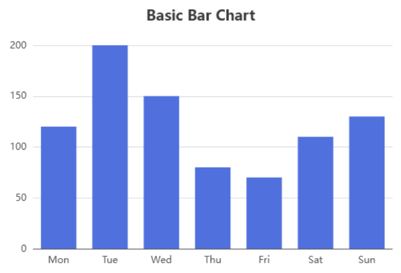

..  include:: ../../../Includes.txt

..  _usingApacheECharts:

====================
Using Apache ECharts
====================

ViewHelpers for `Apache ECharts` were introduced
in version 14.7.0 of SAV Charts. 
Charts must be created using the <c:echarts>
viewHelpers instead of <c:charts> with `Charts.js`.

Since `Apache ECharts`
is also a JavaScript library, the concepts used
in `Charts.js` are exactly the same. All the 
viewHelpers, except <c:charts> and its children,
can be used. Therefore, data can be imported
via queries or spreadsheets, just as with `Charts.js`.
 
Several viewHelpers are provided 
to get started with this library. For example, 
the viewHelper <c:echarts.bar> is used
to create a bar chart, whereas
<c:charts.bar> is used with `Charts.js`.

Several examples of basic charts are provided 
in the directory
`Resources/Private/Templates/EChartsExamples`.
All of the provided examples were
converted from the 
`ECharts Examples section <https://echarts.apache.org/examples/en/index.html>`_.
For instance, adding the following code in the
Template field of the plugin Flexform generates
a basic bar chart. 
 
..  code-block:: xml 
    
    <c:template id="1">
    EXT:sav_charts/Resources/Private/Templates/EChartsExamples/BarChart.fluid"
    </c:template>

