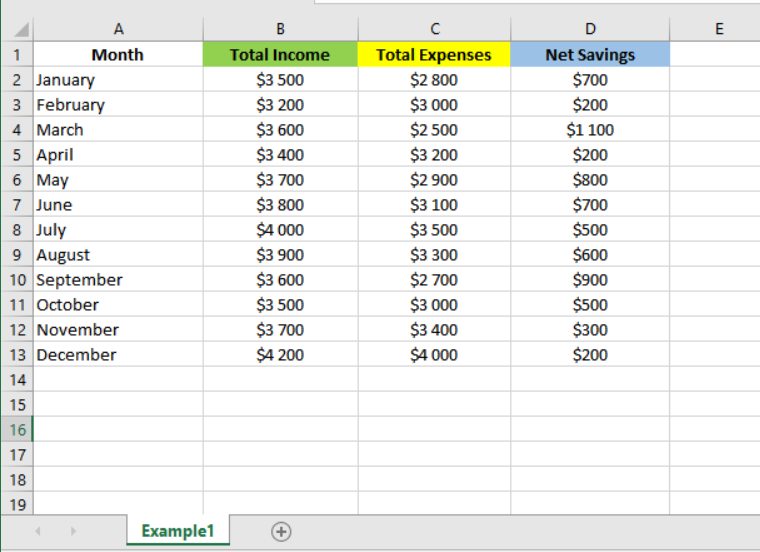
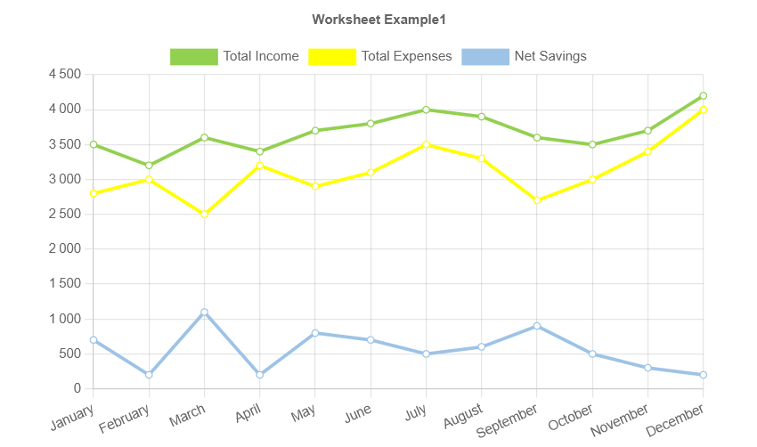
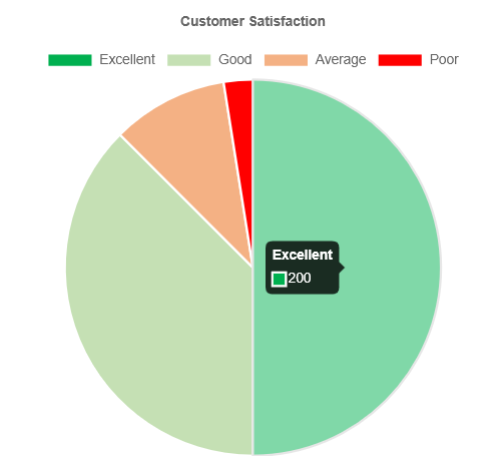
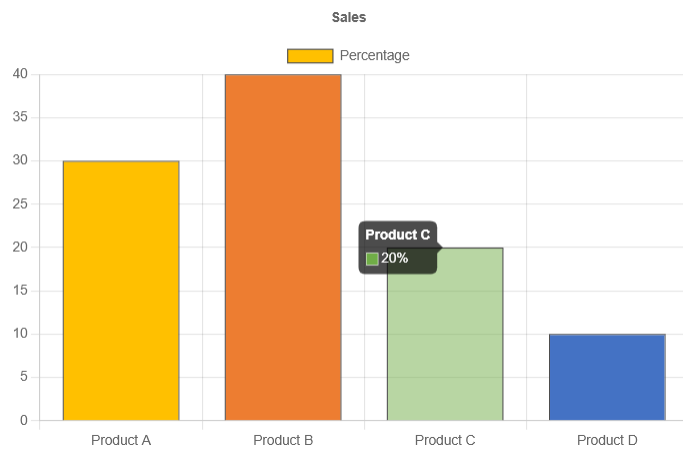

..  include:: ../../../Includes.txt

..  _usingSpreadsheets:

==================
Using Spreadsheets
==================

SAV Charts makes it possible to create charts from
spreadsheets thanks to `PhpSpreadsheet<https://phpspreadsheet.readthedocs.io/en/latest/>`_.

..  important::
    
    Use `composer` to install PhpSpreadsheet into your project
    in order to use this feature.
    
    ..  code-block:: bash
        
        composer require phpoffice/phpspreadsheet

Line Chart from Worksheet
=========================

Assume we want to generate a line chart from the data
provided by the following Excel worksheet.    
    

    
Enter the following code into the template field of the Flexform.
Then save and go to the front.   

..  code-block::
    
    <c:marker id ="title">Worksheet Example1</c:marker>
        
    <c:spreadsheet  fileName="EXT:sav_charts/Resources/Private/Templates/ChartsExamples/Spreadsheet.xlsx"> 
        <c:worksheet name="Example1">

            <!-- Sets the legend -->
            <c:marker id="labelSet0" value="{c:cell.value(address:'B1')}" />
            <c:marker id="labelSet1" value="{c:cell.value(address:'C1')}" />
            <c:marker id="labelSet2" value="{c:cell.value(address:'D1')}" />

            <!-- Gets the colors from the worksheet -->
            <c:data id="worksheetColors">
                <c:item key="0" value="{c:cell.backgroundcolor(address:'B1')}" />
                <c:item key="1" value="{c:cell.backgroundcolor(address:'C1')}" />
                <c:item key="2" value="{c:cell.backgroundcolor(address:'D1')}" />
            </c:data>

            <!-- Sets the color in the datasets -->
            <c:data id="dataSets">
            <f:for each="{data__worksheetColors}" as="color" key="key">
                <c:item key="{key}">
                    <c:item key="backgroundColor" value="{color}" />
                    <c:item key="borderColor" value="{color}" />
                </c:item>
            </f:for>  
            </c:data> 

            <!-- Sets data and labels -->
            <c:data id="labels" values="{c:cell.range(range:'A2:A13')}" />            
            <c:data id="data" values="{c:cell.range(range:'B2:D13')->c:transpose()}" />

        </c:worksheet>
    </c:spreadsheet>
    
    <c:template id="1">
        EXT:sav_charts/Resources/Private/Templates/ChartsExamples/FluidParser/LineChartAdvanced.fluid
    </c:template>

..  note::
    
    The viewHelper <c:cell.range> gets the data from the
    worksheet line by line. Therefore, the data must be transposed
    before being inserted into the data with ID `data`.
    
..  note::
    
    The different fields in the Flexform are just a simple 
    means of organising the code.
    Therefore, you can also split the preceding code into three parts:
   
    -   The marker `title` in the `Markers` field of the Flexform.
    -   The spreadsheet part in the `Data` field of the Flexform.
    -   The template part in the `Templates` field of the Flexform.
         

Pie Chart from Values in Worksheet
==================================

Assume that we want to generate a pie chart showing customer 
satisfaction, using the value column in the following worksheet.
    
..  figure:: ../../../Images/Tutorial/ExcelWorksheetExample2.png
 
Enter the following code into the template field of the Flexform.
Then save and go to the front.   

..  code-block::
           
    <c:spreadsheet  fileName="EXT:sav_charts/Resources/Private/Templates/ChartsExamples/Spreadsheet.xlsx"> 
        <c:worksheet name="Example2">

            <!-- Gets the colors from the worksheet -->
            <c:data id="backgroundColor">
                <c:item key="0" value="{c:cell.backgroundcolor(address:'B14')}" />
                <c:item key="1" value="{c:cell.backgroundcolor(address:'B15')}" />
                <c:item key="2" value="{c:cell.backgroundcolor(address:'B16')}" />
                <c:item key="3" value="{c:cell.backgroundcolor(address:'B17')}" />                
            </c:data>
            
            <c:data id="hoverBackgroundColor">
                <c:item key="0" value="{c:cell.backgroundcolor(address:'B14', alpha:50)}" />
                <c:item key="1" value="{c:cell.backgroundcolor(address:'B15', alpha:50)}" />
                <c:item key="2" value="{c:cell.backgroundcolor(address:'B16', alpha:50)}" />
                <c:item key="3" value="{c:cell.backgroundcolor(address:'B17', alpha:50)}" />                
            </c:data>         

            <!-- Sets data and labels -->
            <c:data id="labels" values="{c:cell.range(range:'B14:B17')}" />  
            <c:data id="dataSet0" values="{c:cell.range(range:'C14:C17')}" />

            <!-- Sets options -->
            <c:data id="pieChartOptions">
                <c:item key="plugins">
                    <c:item key="title">
                        <c:item key="display" value="true" />
                        <c:item key="text" value="{c:cell.value(address:'A14')}" />
                    </c:item>
                </c:item>                               
            </c:data>
            
        </c:worksheet>
    </c:spreadsheet>
    
    <c:template id="1">
        EXT:sav_charts/Resources/Private/Templates/ChartsExamples/FluidParser/PieChart.fluid
    </c:template>

As it can be seen in the following figure, the tiptool provides the
value as entered in the worksheet.
    

Pie Chart from Percentages in Worksheet
=======================================

Now assume we want to generate the pie chart from the percentage
column. The values in this column are calculated using 
formulas. For example, the value in cell `D14` is 
obtained using the formula `=C14/C18`. The result 
is actually 0.5, but it is displayed as 50% because 
this cell uses the percentage format. 

This has consequences for the range view helper, 
in that several arguments must be taken into account:

-   The argument `calculateFormulas` must be set to true, 
    which is the default value. 
-   If the argument `formatData` is set to false 
    (the default value), the imported data for cell `D14`
    will be 0.5. This will need to be multiplied by 100 
    to obtain the percentage, and the % sign will need 
    to be added in the tooltip. If it is set to true, 
    the imported data will be 50%. 
    In this case, the % sign will have 
    to be removed from the chart data, 
    but kept in the tip tool.
    
The following code illustrates the case where default
values are kept for both previous arguments. The tiptool is modified
by a callback function.
    
..  code-block::
           
    <c:spreadsheet  fileName="EXT:sav_charts/Resources/Private/Templates/ChartsExamples/Spreadsheet.xlsx"> 
        <c:worksheet name="Example2">

            <!-- Gets the colors from the worksheet -->
            <c:data id="backgroundColor">
                <c:item key="0" value="{c:cell.backgroundcolor(address:'B14')}" />
                <c:item key="1" value="{c:cell.backgroundcolor(address:'B15')}" />
                <c:item key="2" value="{c:cell.backgroundcolor(address:'B16')}" />
                <c:item key="3" value="{c:cell.backgroundcolor(address:'B17')}" />                
            </c:data>
            
            <c:data id="hoverBackgroundColor">
                <c:item key="0" value="{c:cell.backgroundcolor(address:'B14', alpha:50)}" />
                <c:item key="1" value="{c:cell.backgroundcolor(address:'B15', alpha:50)}" />
                <c:item key="2" value="{c:cell.backgroundcolor(address:'B16', alpha:50)}" />
                <c:item key="3" value="{c:cell.backgroundcolor(address:'B17', alpha:50)}" />                
            </c:data>         

            <!-- Sets data and labels -->
            <c:data id="labels" values="{c:cell.range(range:'B14:B17')}" />  
            <c:data id="dataSet0" values="{c:cell.range(range:'D14:D17')}" />

            <!-- Sets options -->
            <c:data id="pieChartOptions">
                <c:item key="plugins">
                    <c:item key="title">
                        <c:item key="display" value="true" />
                        <c:item key="text" value="{c:cell.value(address:'A14')}" />
                    </c:item>
                    <c:item key="tooltip">
                        <c:item key="backgroundColor">rgba(0,0,0,0.7)</c:item>
                        <c:item key="callbacks">
                            <c:callback key="label">
                                function(context) {
                                    return (' ' + parseFloat((context.formattedValue).replace(',', '.')) * 100.0) + '%';
                                }
                            </c:callback>
                        </c:item>
                    </c:item>                    
                </c:item>                               
            </c:data>
            
        </c:worksheet>
    </c:spreadsheet>
    
    <c:template id="1">
        EXT:sav_charts/Resources/Private/Templates/ChartsExamples/FluidParser/PieChart.fluid
    </c:template>    

..  figure:: ../../../Images/Tutorial/ExcelWorksheetExample2PieChartPercentage.png

Bar Chart from Percentages in Worksheet
=======================================

This example illustrates a case in which the `formatData` argument is set to true 
in the range viewHelper. It deals with the sales represented
as a bar chart. Fluid processing removes the percentage sign.

..  code-block::
    
    <c:marker id="labelSet0">Percentage</c:marker>

    <c:spreadsheet  fileName="EXT:sav_charts/Resources/Private/Templates/ChartsExamples/Spreadsheet.xlsx"> 
        <c:worksheet name="Example2">

            <c:marker id="title">{c:cell.value(address:'A2')}</c:marker>

            <!-- Gets the colors from the worksheet -->
            <c:data id="backgroundColor">
                <c:item key="0" value="{c:cell.color(address:'B2')}" />
                <c:item key="1" value="{c:cell.color(address:'B3')}" />
                <c:item key="2" value="{c:cell.color(address:'B4')}" />
                <c:item key="3" value="{c:cell.color(address:'B5')}" />                
            </c:data>
            
            <c:data id="hoverBackgroundColor">
                <c:item key="0" value="{c:cell.color(address:'B2', alpha:50)}" />
                <c:item key="1" value="{c:cell.color(address:'B3', alpha:50)}" />
                <c:item key="2" value="{c:cell.color(address:'B4', alpha:50)}" />
                <c:item key="3" value="{c:cell.color(address:'B5', alpha:50)}" />                
            </c:data>   
            
            <!-- Sets data and labels -->
            <c:data id="labels" values="{c:cell.range(range:'B2:B5')}" />  
            <c:data id="data" values="{c:cell.range(range:'D2:D5', formatData:true, search:{0:'%',1:','}, replace:{0:'',1:'.'})->c:transpose()}" />

            <c:data id="dataSets">
                <c:item key="0">
                    <c:item key="data" value="{data__data.0}" />
                    <c:item key="backgroundColor" value="{data__backgroundColor}" />
                    <c:item key="hoverBackgroundColor" value="{data__hoverBackgroundColor}" />
                </c:item>
            </c:data>             

        </c:worksheet>
    </c:spreadsheet>
    
    <c:data id="barChartOptions">
        <c:item key="plugins">
            <c:item key="title">
                <c:item key="display" value="true" />
                <c:item key="text" value="{marker__title}" />
            </c:item>
            <c:item key="tooltip">
                <c:item key="backgroundColor">rgba(0,0,0,0.7)</c:item>
                <c:item key="callbacks">
                    <c:callback key="label">
                        function(context) {
                            return context.formattedValue + '%';
                        }
                    </c:callback>
                </c:item>
            </c:item>
        </c:item>
    </c:data> 

    <c:template id="1">
        EXT:sav_charts/Resources/Private/Templates/ChartsExamples/FluidParser/barChartAdvanced.fluid
    </c:template>         

In this example, the range viewHelper retains the cell 
format.The arguments `search` and `replace` are used to
search for the percent and comma signs, respectively 
replacing them with an empty space and a period. As 
previously explained, the data must be transposed.

The `search` and `replace` arguments behave exactly like
the corresponding arguments in the PHP str_replace()
function. They are used here as arrays.
Here, they are used as arrays.

The bar chart colors are taker from the font color of
the items.

    
