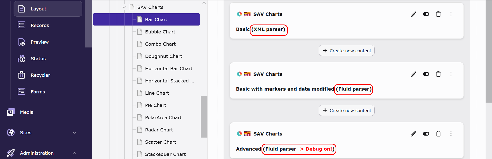
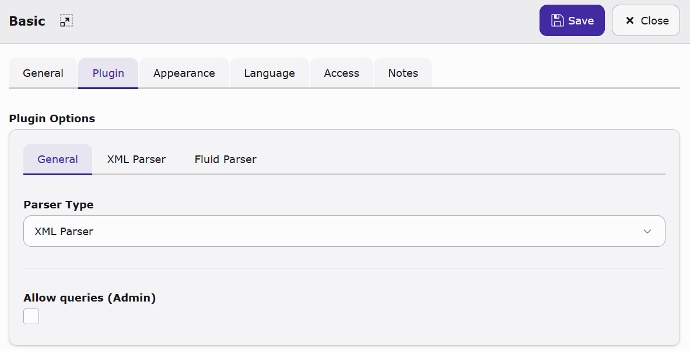
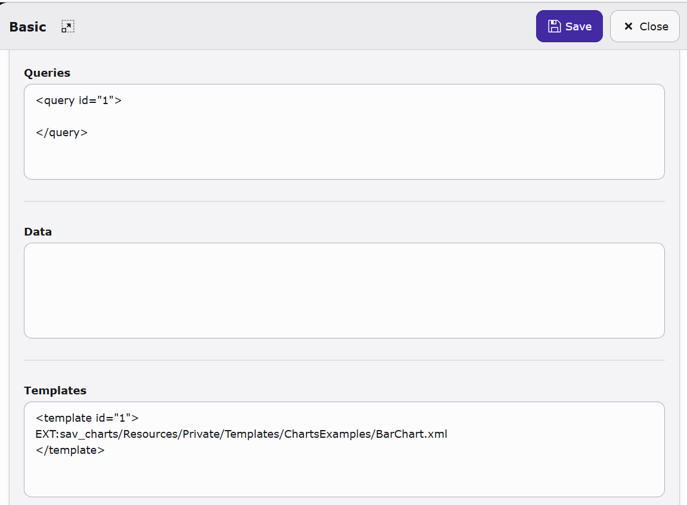
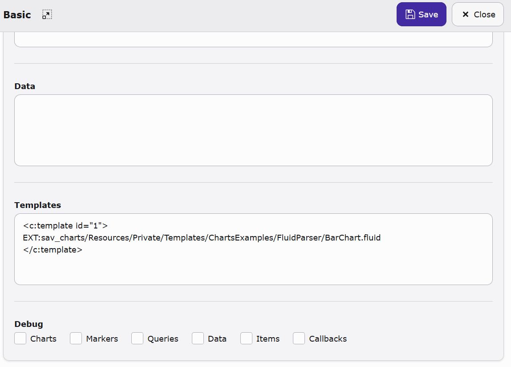

..  include:: ../../Includes.txt

..  _pluginInterface:

================
Plugin Interface
================

In layout mode, the SAV Charts plugins are displayed
with a modified header that provides additional
information about the parser in use and the possible
debug mode for the Fluid parser.

    
The plugin options contain three tabs. The first tab
is for general configuration. This includes selecting
the parser type and granting the right to use queries.
The latter must be granted by an admin user.

The second tab is for XML parser configuration.
It contains the same fields as the previous version
of the SAV Charts extension.

The third tab is for the Fluid parser configuration.
This contains the same fields as the second tab, plus
a debug feature.

