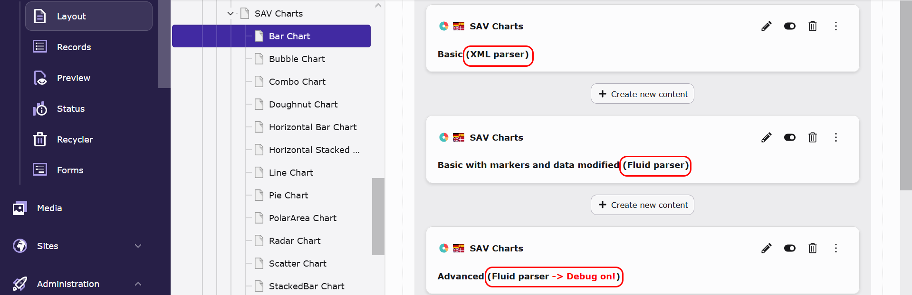
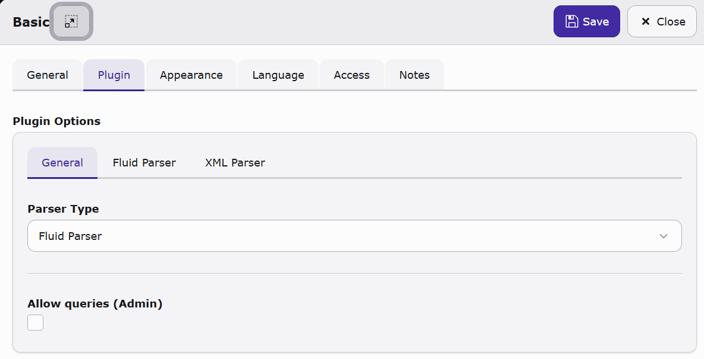
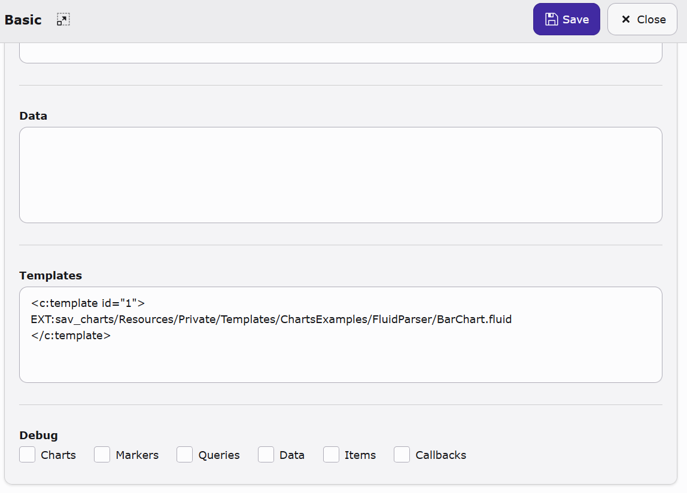
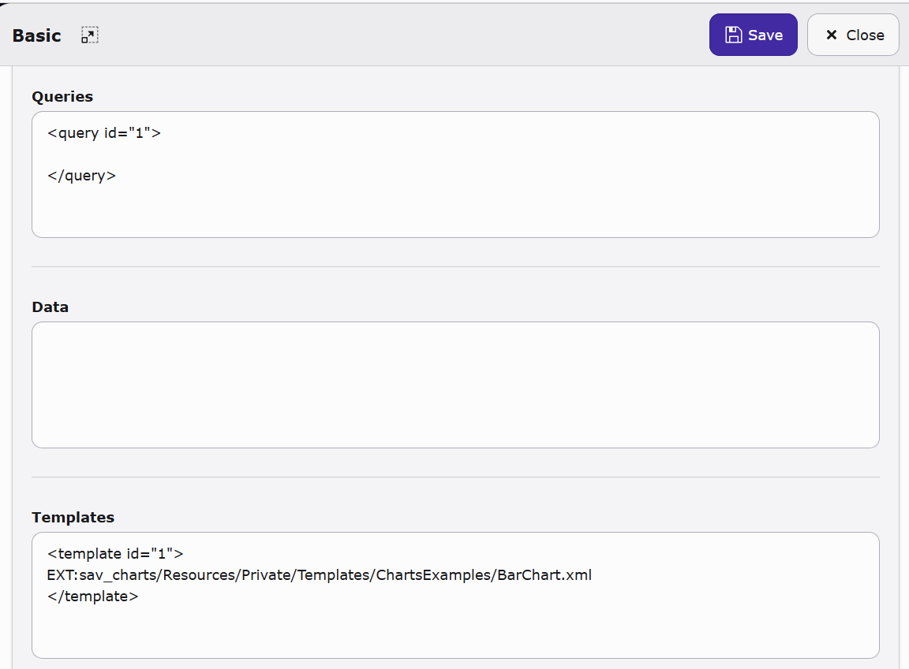

..  include:: ../../Includes.txt

..  _pluginInterface:

================
Plugin Interface
================

In layout mode, the SAV Charts plugins are displayed
with a modified header that provides additional
information about the parser in use and the possible
debug mode for the Fluid parser.

    
The plugin options contain three tabs. The first tab
is for the general configuration. This includes selecting
the parser type and granting permission to use queries.
Granting the right to use queries must be done by an admin user

The second tab is for the Fluid parser configuration.
It contains fields for markers, queries, data, and templates, as well
as a debug feature. These fields provide an easy 
way to organize the code.

The third tab is for the XML parser configuration.
It contains all the fields from the second tab except
the debug feature.

