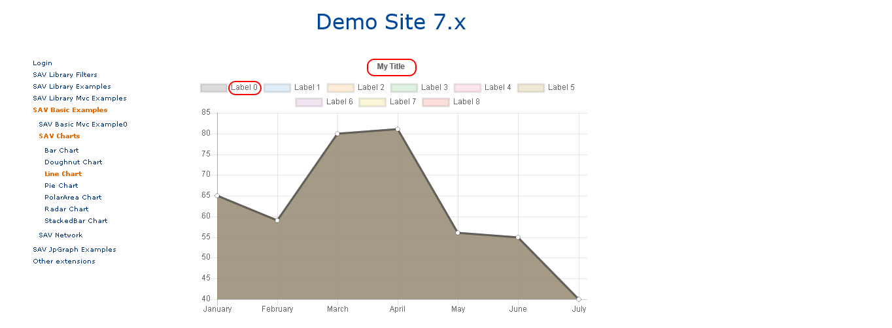
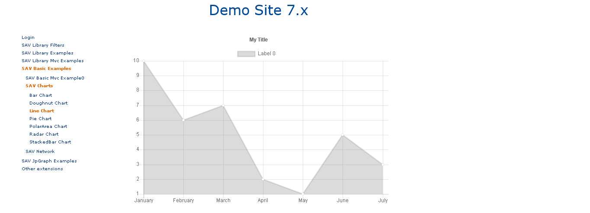
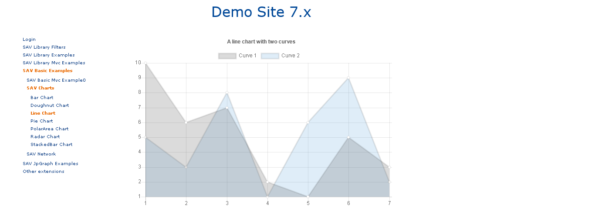

.. include:: ../../Includes.txt

.. _usingAdvancedTemplates:

========================
Using Advanced templates
========================

More complex templates are provided with SAV Charts. They can display 
upto to 9 items in the same charts. 

Colors are defined in a specific template **DefaultColors.xml** 
which were chosen to provide constrast between items.

Let us illustrate the use of advanced templates with, for example, 
the template **LineChartAdvanced.xml**.

In the template section enter the following code, save and go in the frontend.

.. code::

   <template id="1">
      typo3conf/ext/sav_charts/Resources/Private/Templates/ChartsExamples/LineChartAdvanced.xml
   </template>  
    

The chart has 9 superposed curves with the same data, predefined 
colors, predefined labels and a predefined title.

In the data section enter the following code, save and go in the frontend.  

.. code::

   <data id="data">
      <item key="0" values="10, 6, 7, 2, 1, 5, 3" />     
   </data>  
    

 
Modify the data section as follows:

.. code::

   <data id="data">
      <item key="0" values="10, 6, 7, 2, 1, 5, 3" />
      <item key="1" values="5, 3, 8, 1, 6, 9, 2" />
   </data>  
    
   <data id="labels">
      1, 2, 3, 4, 5, 6, 7
   </data>
    
In the marker section, enter the following code, save and go in the frontend.

.. code::

   <marker id="title">A line chart with two curves</marker> 
   <marker id="labelSet0">Curve 1</marker> 
   <marker id="labelSet1">Curve 2</marker> 
         

