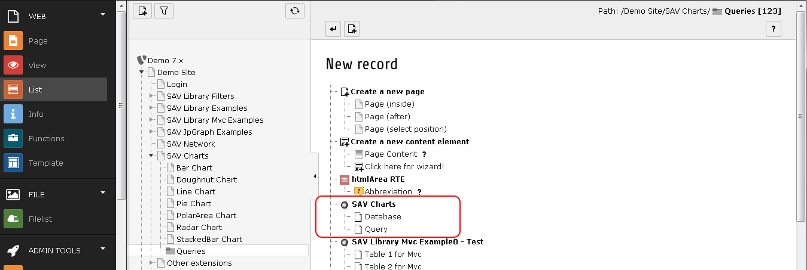
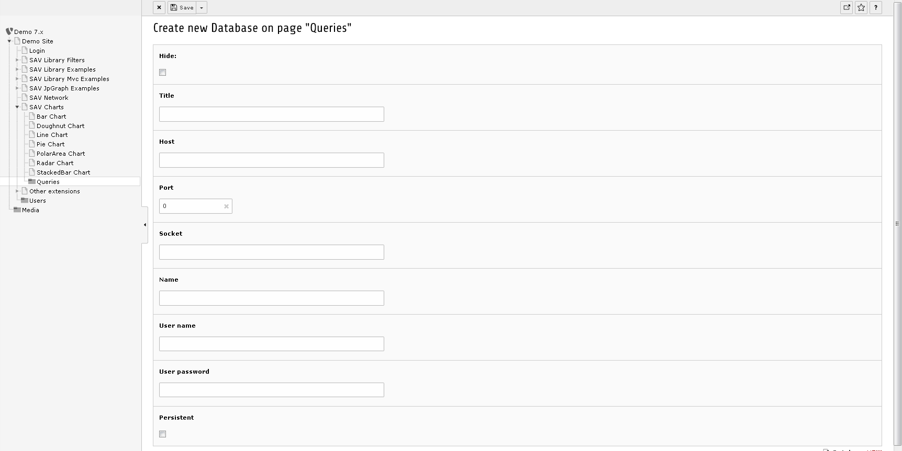
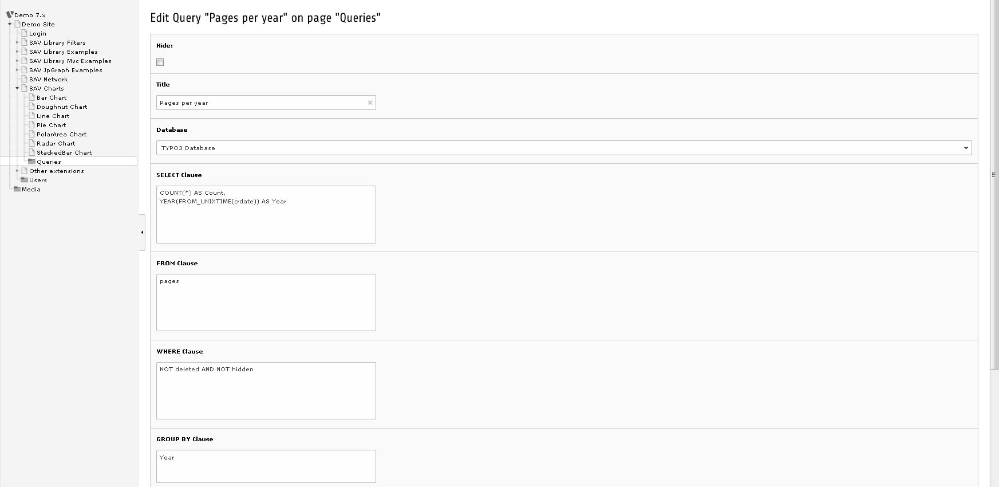
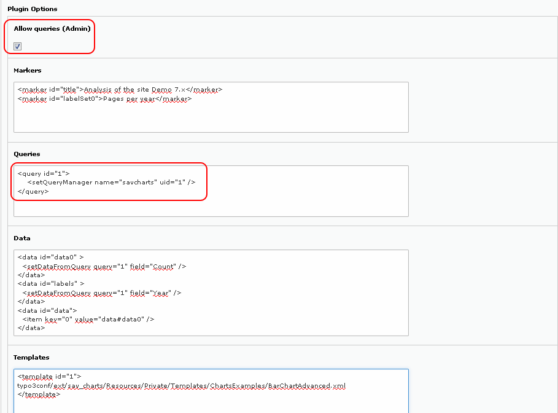
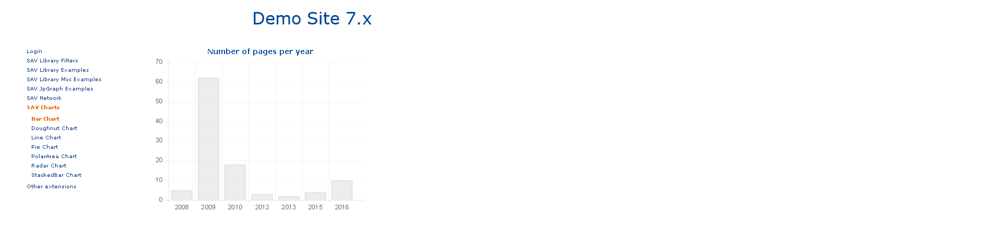

.. include:: ../../Includes.txt

.. _usingAndDevelopingQueryManagers:

===================================
Using and Developing Query Managers
===================================

Query managers are used in <query> tags to execute queries which can be used in charts.

SAV Charts extension comes with an internal query manager named ``savcharts`` which can
deal with TYPO3 database queries as well as queries from other databases.

Using the Query Manager
=======================

In the backend in list mode create a new record in a page or a folder.

Select ``Database`` if you need to access to an external database, 
fill the different fields and save.

.. tip::

   You do not need to create a new database access if you only need 
   to access to the current TYPO3 database.

Select ``Query`` to create a query. Select a database (default is 
``TYPO3 Database``), fill the different clauses and save. 

The following figure illustrates the query to display the number of pages per year.

Assuming that the new query has the id ``1``, the following flexform 
configuration displays a bar chart with the 
number of pages per year. 

In the ``Queries`` section, the default query manager ``savcharts`` is used. 
It calls the query whose uid is 1.

The ``Data`` section of the flexform overloads the template to display 
only a single barchart
with the data provided by the query, as explained in the section :ref:`usingAdvancedTemplates`.

.. important::

   The flag ``Allow queries (Admin)`` must be set by an Admin user in the content 
   flexform to execute queries.

Go to the frontend to display the resulting chart.

Developing Your Query Manager
=============================

Query managers are implemented by means of hooks.The hook for the internal query manager 
is in ``Classes/Hooks/SavChartsQueryManager.php``. This class extends the abstract class 
AbstractQueryManager (``Classes/Hooks/AbstractQueryManager.php``)
which itself implements the interface QueryManagerInterface 
(``Classes/Hooks/QueryManagerInterface.php``).

You can develop your own query manager by providing a hook which must 
be added in the file ``ext_localconf.php``
of your extension. 

Assuming that your vendor name is ``MyVendorName`` and your extension 
name is ``my_extension``. Assuming also 
that you have written your manager as the class MyQueryManager 
in ``Classes/Hooks/MyQueryManager.php``. 
Finally, assuming that you want to name your query manager ``myManager``, you should add 
the following code in ``ext_localconf.php`` of your extension.

.. code::

   $TYPO3_CONF_VARS['EXTCONF'][$_EXTKEY]['queryManagerClass']['myManager'] = \MyVendorName\MyExtension\Hooks\MyQueryManager::class;

