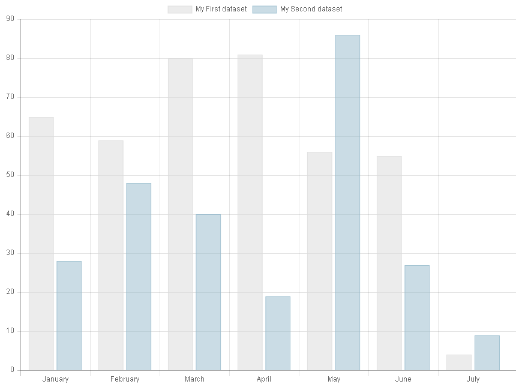
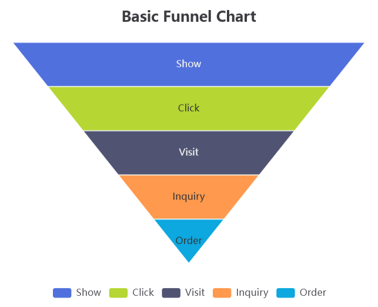

# TYPO3 Extension SAV Charts (sav_charts)

This exension uses the 
[Chart.js](https://www.chartjs.org/),
[Apache ECharts](https://echarts.apache.org/), or
[ApexCharts](https://apexcharts.com/) libraries
to display charts.

* SAV Charts comes with several basic templates 
  for Charts.js, Apache ECharts and ApexCharts.
        
* Advanced templates that simplify 
  the  implementation 
  of charts with several sets of data are 
  also available for the Charts.js library.

* Data can be entered directly into templates 
  or  via queries or spreadsheets.

## Bar Chart with Charts.js

## Funnel Chart with Apache ECharts

## Doughnut Chart with ApexCharts

## Links
* [Github](https://github.com/YolfTypo3/SavCharts)
* [Documentation](https://docs.typo3.org/p/yolftypo3/sav-charts/main/en-us/)
* [TYPO3 Extension Repository](https://extensions.typo3.org/extension/sav_charts)
* [Sponsor](https://www.paypal.me/LaurentFOULLOY)